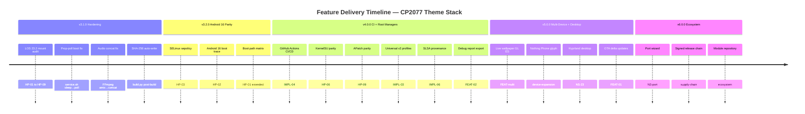
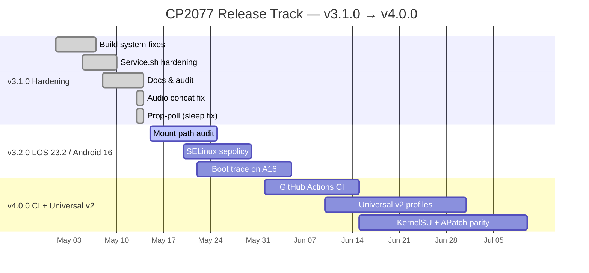
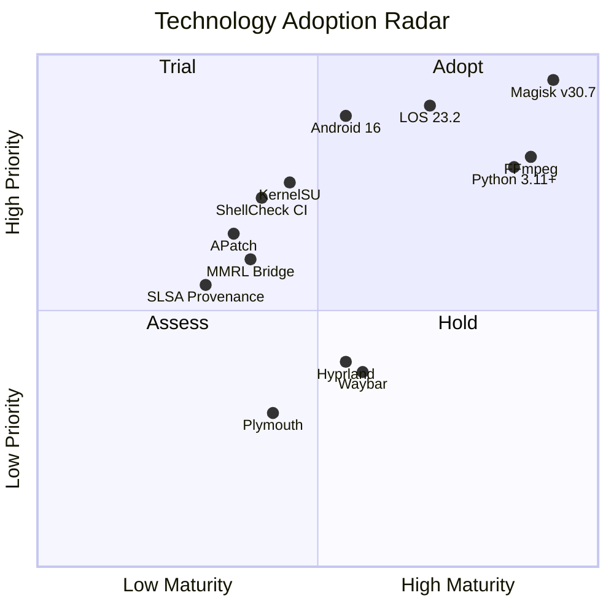
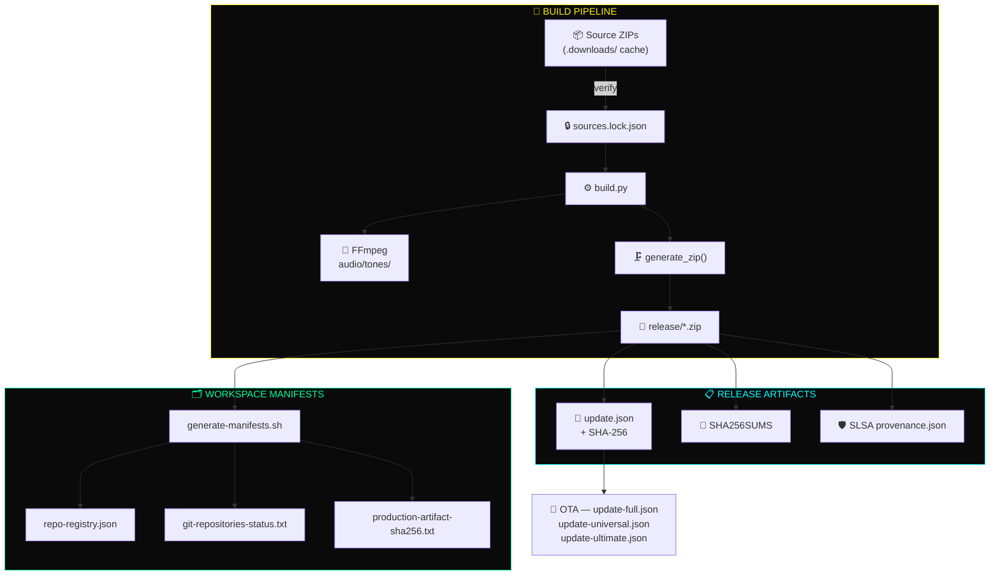
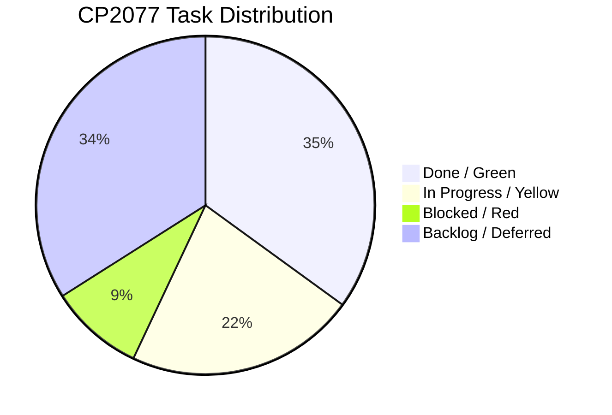
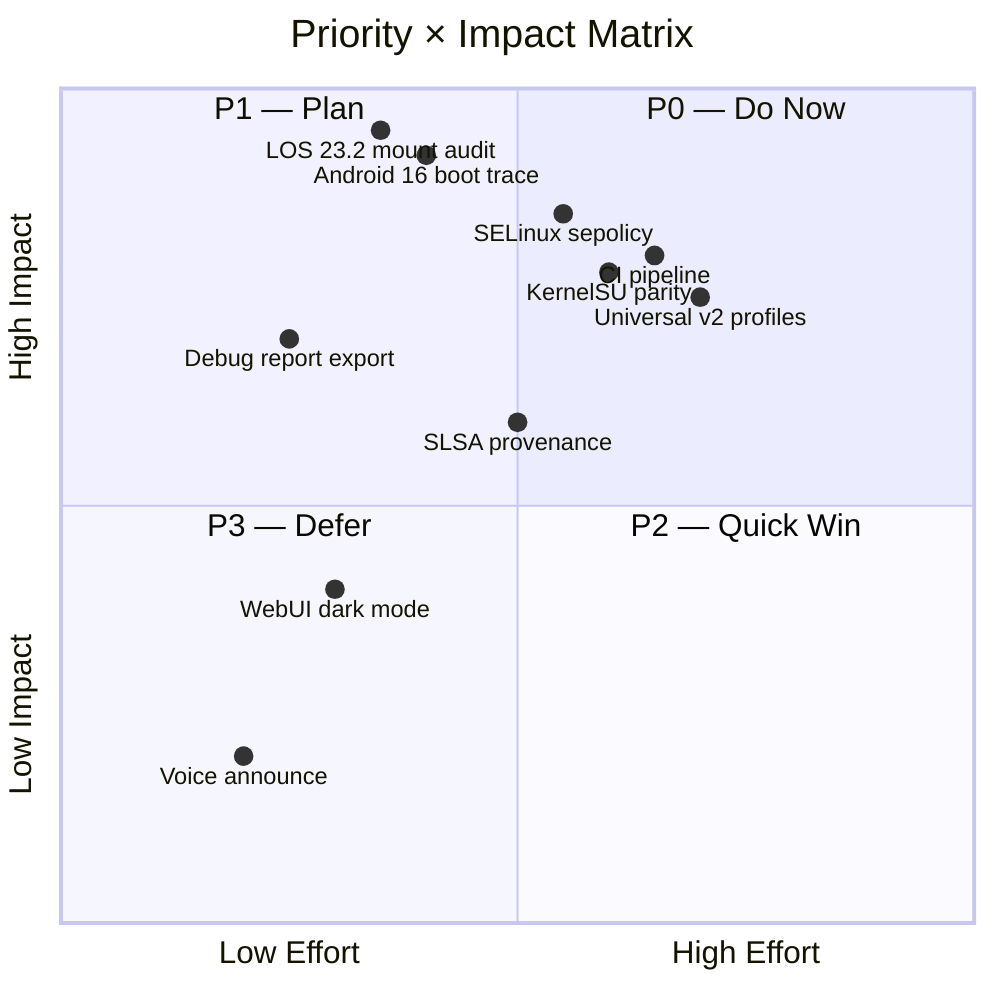
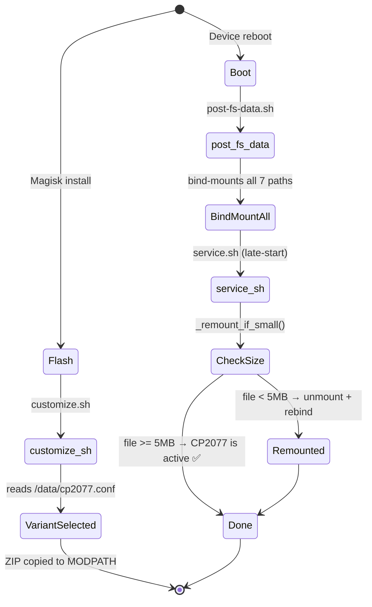
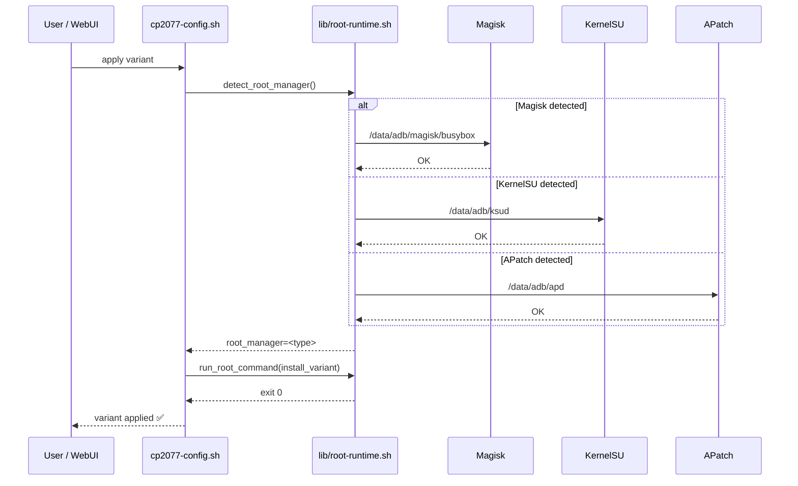

# ▓▓▓▓▓▓▓▓▓▓▓▓▓▓▓▓▓▓▓▓▓▓▓▓▓▓▓▓▓▓▓▓▓▓▓▓▓▓▓▓▓▓▓▓▓▓▓▓▓▓▓▓▓▓▓▓▓▓▓▓▓▓

```
 ██████╗ ██████╗ ██████╗ ██████╗ ███████╗
██╔════╝ ██╔══██╗╚════██╗╚════██╗╚════██║
██║      ██████╔╝  ████╔╝  ████╔╝    ██╔╝
██║      ██╔═══╝   ╚══██╗  ╚══██╗   ██╔╝
╚██████╗ ██║      ██████╔╝ ██████╔╝ ██║
 ╚═════╝ ╚═╝      ╚═════╝  ╚═════╝  ╚═╝

 ┌────────────────────────────────────────────────────────────────┐
 │   CYBERPUNK 2077  ·  ANDROID MAGISK THEME STACK               │
 │   ══════════════════════════════════════════════════════════   │
 │   TRACK     v3.2.0  ·  SPRINT  v3.1.0 Hardening              │
 │   STABLE    v3.0.0  ·  UNI     v1.0.0  ·  14 ROM families    │
 │   ══════════════════════════════════════════════════════════   │
 │   DEVICES   OnePlus 7 Pro GM1911  ·  Universal (all devices)  │
 │   ROOT      Magisk v30.7  ·  KernelSU α  ·  APatch α         │
 │   TARGET    LOS 23.2 / Android 16 / OOS 14+                   │
 └────────────────────────────────────────────────────────────────┘
```

---

## ══ QUICK STATUS ══

> [!NOTE]
> All status indicators reflect the current production state. 🟢 = live & passing, 🟡 = built not deployed, ⚪ = intentionally disabled.

```
╔══════════════════════════════════════════════════════════════════════════════╗
║  MODULE STATUS PANEL                                          2026-05-14    ║
╠══════════════╦═══════════╦═════════╦══════════╦═════════════╦═══════════════╣
║  MODULE      ║  STATE    ║  VER    ║  BUGS    ║  SCOPE      ║  NOTES        ║
╠══════════════╬═══════════╬═════════╬══════════╬═════════════╬═══════════════╣
║  OP7Pro Full ║ 🟢 LIVE   ║ v3.1.0  ║  18/0 ✅ ║  GM1911     ║  Active prod  ║
║  Universal   ║ 🟡 BUILT  ║ v1.0.0  ║  14 ROMs ║  all-device ║  Needs deploy ║
║  Ultimate    ║ ⚪ DISABLE ║ v3.0.0  ║  —       ║  GM1911+    ║  vCode fixed  ║
╠══════════════╩═══════════╩═════════╩══════════╩═════════════╩═══════════════╣
║  HEALTH:  Audit ✅ 10/10  ·  Open bugs ✅ 0  ·  CI Coverage 🔴 40%         ║
╚══════════════════════════════════════════════════════════════════════════════╝
```

```
 RELEASE TRACK ──────────────────────────────────────────────────────────────
 v3.0.0 ████████████████████████████████████████████  STABLE   ✅ tagged
 v3.1.0 ████████████████████████████████████░░░░░░░░  ACTIVE   🔄 hardening
 v3.2.0 ████████████████░░░░░░░░░░░░░░░░░░░░░░░░░░░░  PLANNED  📋 LOS23/A16
 v4.0.0 ██████░░░░░░░░░░░░░░░░░░░░░░░░░░░░░░░░░░░░░░  FUTURE   🔜 CI+Uni v2
```

**Badges:** `v3.1.0 complete` · `audit: 10/10` · `bugs: 0 open` · `v4.0.0 groundwork: 3/12`

---

## ══ TABLE OF CONTENTS ══

| Section | Description |
|:--------|:-----------|
| [🔥 Hot Path](#hot-path--p0-blockers) | P0 blockers — must be resolved before v3.2.0 |
| [📡 Feature Radar](#feature-radar) | Feature delivery timeline by version |
| [🏃 Sprint Progress](#sprint-progress) | Gantt chart + sprint bar indicators |
| [🏗️ Build Matrix](#build-matrix) | Per-variant artifact status |
| [⚠️ Risk Register](#risk-register) | Active risks and mitigations |
| [📦 Version Codex](#version-codex) | Release track summaries |
| [🔭 Tech Radar](#tech-radar) | Quadrant chart — adopt/trial/assess/hold |
| [📋 Decision Log](#decision-log) | Architectural invariants |
| [🔗 Dependency Graph](#dependency-graph) | Build pipeline Mermaid flowchart |
| [📊 Metrics Dashboard](#metrics-dashboard) | Health indicators + pie chart |
| [🎨 Design Tokens](#design-tokens) | CP2077 neon palette reference |
| [🎯 Priority Matrix](#priority-matrix) | P0–P3 quadrant + counts |
| [✨ New Features](#new-features) | FEAT-01–10 backlog |
| [⚙️ New Implementations](#new-implementations) | IMPL-01–10 backlog |
| [🗂️ New Sections](#new-sections-10) | NS-01–35 architecture diagrams |
| [🔧 New Tools](#new-tools-20) | TOOL-01–20 toolchain |
| [📝 Execution Backlog](#execution-backlog) | Full P0/P1/P2/P3 task lists |
| [🗺️ Phased Roadmap](#phased-roadmap--10-phases-100-tasks) | 10-phase, 100+ task plan |
| [📱 Device Expansion](#device-expansion-targets) | Target device matrix |
| [🔬 Performance Benchmarks](#performance-benchmarks) | Boot timing metrics |
| [✅ Completed Ledger](#completed-ledger) | Shipped and closed tasks |

---

## ══ HOT PATH — P0 BLOCKERS ══

> [!WARNING]
> Items HP-01 through HP-09 are **hard blockers** for v3.2.0. Nothing ships until all are green. HP-10 through HP-15 were resolved in the prior audit sprint.

```
 ┌──────────────────────────────────────────────────────────────────────────┐
 │  STATUS KEY:  ⬛ BLOCKER  ·  ✓ FIXED  ·  🔴 P0  ·  ✅ CLOSED            │
 ├──────────────────────────────────────────────────────────────────────────┤
 │  HP-01  ⬛⬛⬛⬛⬛⬛⬛⬛  🔴  LOS 23.2 mount path audit                   │
 │  HP-02  ⬛⬛⬛⬛⬛⬛⬛⬛  🔴  Android 16 boot timing trace                │
 │  HP-03  ⬛⬛⬛⬛⬛⬛⬛⬛  🔴  SELinux avc denial + sepolicy.rule          │
 │  HP-04  ⬛⬛⬛⬛⬛⬛⬛⬛  🔴  Audio path verification LOS 23.2            │
 │  HP-05  ⬛⬛⬛⬛⬛⬛⬛⬛  🔴  Magisk WebUI 5-bridge verification          │
 │  HP-06  ⬛⬛⬛⬛⬛⬛⬛⬛  🔴  KernelSU module.json parity                 │
 │  HP-07  ⬛⬛⬛⬛⬛⬛⬛⬛  🔴  5 MB remount threshold re-validation        │
 │  HP-08  ⬛⬛⬛⬛⬛⬛⬛⬛  🔴  DEVICE-SPECS.md refresh LOS 23.2           │
 │  HP-09  ⬛⬛⬛⬛⬛⬛⬛⬛  🔴  APatch apd path discovery (v0.10+)         │
 ├──────────────────────────────────────────────────────────────────────────┤
 │  HP-10  ✓ FIXED   Supply chain SHA-256 — build.py writes checksum       │
 │  HP-11  ✓ FIXED   ADB flash RELEASE_ZIP stale v3.0.0 path              │
 │  HP-12  ✓ FIXED   ADB switch clobbers audio/silent config               │
 │  HP-13  ✓ FIXED   og4k variant unreachable via ADB switch               │
 │  HP-14  ✓ FIXED   update.json wrong repo + broken changelog URL         │
 │  HP-15  ✓ FIXED   Ultimate versionCode=300001 off-by-one + wrong feed   │
 └──────────────────────────────────────────────────────────────────────────┘
```

| ID | Task | Pri | Owner | Status |
|:---|:-----|:---:|:-----:|:------:|
| HP-01 | LOS 23.2 mount path audit — all 7 known paths | 🔴 P0 | — | ⬛ |
| HP-02 | Android 16 boot timing trace — `post-fs-data.sh` + `service.sh` | 🔴 P0 | — | ⬛ |
| HP-03 | SELinux `avc` denial audit → generate `sepolicy.rule` | 🔴 P0 | — | ⬛ |
| HP-04 | Audio path verification on LOS 23.2 `/product/media/audio/ui/` | 🔴 P0 | — | ⬛ |
| HP-05 | Magisk WebUI verification — 5 bridge functions on Android 16 WebView | 🔴 P0 | — | ⬛ |
| HP-06 | KernelSU `module.json` parity with Magisk install behavior | 🔴 P0 | — | ⬛ |
| HP-07 | 5 MB remount threshold re-validation on LOS 23.2 stock stubs | 🔴 P0 | — | ⬛ |
| HP-08 | `DEVICE-SPECS.md` refresh with LOS 23.2 confirmed results | 🔴 P0 | — | ⬛ |
| HP-09 | APatch `apd` path discovery — document paths for APatch v0.10+ | 🔴 P0 | — | ⬛ |
| HP-10 | ~~Supply chain verification~~ — `build.py` writes real SHA-256 to `update.json` | ✅ | audit | ✅ |
| HP-11 | ~~ADB flash always failed~~ — `RELEASE_ZIP` path updated to v3.1.0 | ✅ | audit | ✅ |
| HP-12 | ~~ADB switch wiped config~~ — reads-before-write pattern applied | ✅ | audit | ✅ |
| HP-13 | ~~og4k unreachable via ADB~~ — added as `[5]` in valid variants | ✅ | audit | ✅ |
| HP-14 | ~~update.json wrong zipUrl + changelog 404~~ — both fixed | ✅ | audit | ✅ |
| HP-15 | ~~Ultimate versionCode=300001~~ — fixed to 300000; own OTA feed | ✅ | audit | ✅ |

---

## ══ FEATURE RADAR ══



```
 FEATURE COVERAGE GRID ──────────────────────────────────────────────────────
             ┌────────────┬────────────┬────────────┬────────────┐
             │  v3.1.0    │  v4.0.0    │  v5.0.0    │  Backlog   │
 ────────────┼────────────┼────────────┼────────────┼────────────┤
 Root        │ ▓▓▓▓▓▓▓▓▓▓ │ ░░░░░░░░░░ │ ░░░░░░░░░░ │ ░░░░░░░░   │
 CI/CD       │ ░░░░░░░░░░ │ ▓▓▓▓▓▓▓▓▓▓ │ ░░░░░░░░░░ │ ░░░░░░░░   │
 Universal   │ ░░░░░░░░░░ │ ▓▓▓▓▓▓▓▓▓▓ │ ░░░░░░░░░░ │ ░░░░░░░░   │
 KSU         │ ░░░░░░░░░░ │ ▓▓▓▓▓▓▓▓▓▓ │ ░░░░░░░░░░ │ ░░░░░░░░   │
 APatch      │ ░░░░░░░░░░ │ ▓▓▓▓▓▓▓▓▓▓ │ ░░░░░░░░░░ │ ░░░░░░░░   │
 SupChain    │ ░░░░░░░░░░ │ ▓▓▓▓▓▓▓▓▓▓ │ ░░░░░░░░░░ │ ░░░░░░░░   │
 Variants    │ ░░░░░░░░░░ │ ▓▓▓▓▓▓▓▓▓▓ │ ░░░░░░░░░░ │ ░░░░░░░░   │
 Wallpaper   │ ░░░░░░░░░░ │ ░░░░░░░░░░ │ ▓▓▓▓▓▓▓▓▓▓ │ ░░░░░░░░   │
 MultiDev    │ ░░░░░░░░░░ │ ░░░░░░░░░░ │ ▓▓▓▓▓▓▓▓▓▓ │ ░░░░░░░░   │
 Desktop     │ ░░░░░░░░░░ │ ░░░░░░░░░░ │ ▓▓▓▓▓▓▓▓▓▓ │ ░░░░░░░░   │
 OTA Delta   │ ░░░░░░░░░░ │ ░░░░░░░░░░ │ ░░░░░░░░░░ │ ▓▓▓▓▓▓▓▓   │
 Plymouth    │ ░░░░░░░░░░ │ ░░░░░░░░░░ │ ░░░░░░░░░░ │ ▓▓▓▓▓▓▓▓   │
 Audio Suite │ ░░░░░░░░░░ │ ░░░░░░░░░░ │ ░░░░░░░░░░ │ ▓▓▓▓▓▓▓▓   │
             └────────────┴────────────┴────────────┴────────────┘
  ▓ = Active   ░ = Planned
```

---

## ══ SPRINT PROGRESS ══

**v3.1.0 Hardening**



```
 SPRINT BARS ─────────────────────────────────────────────────────────────────
 Build      [██████████████████████████████] 7/7   100%  🟢  DONE
 Service    [██████████████████████████████] 5/5   100%  🟢  DONE
 Docs       [██████████████████████████████] 6/6   100%  🟢  DONE
 Audit      [██████████████████████████████] 10/10 100%  🟢  DONE
 LOS 23.2   [░░░░░░░░░░░░░░░░░░░░░░░░░░░░░░] 0/10  0%    🔴  PENDING
 v4.0.0 Prep[████████░░░░░░░░░░░░░░░░░░░░░░] 3/12  25%   🟡  IN PROGRESS
```

| Area | Done | Total | Pct | Status |
|:-----|:----:|:-----:|:---:|:------:|
| Build | 7 | 7 | 100% | 🟢 |
| Service | 5 | 5 | 100% | 🟢 |
| Docs | 6 | 6 | 100% | 🟢 |
| Audit | 10 | 10 | 100% | 🟢 |
| LOS 23.2 | 0 | 10 | 0% | 🔴 |
| v4.0.0 Prep | 3 | 12 | 25% | 🟡 |

### Variant Work

| Variant | Status | Resolution | FPS | Audio | Ship |
|:--------|:------:|:-----------|:---:|:-----:|:----:|
| `og4k` | ✅ Done | 2160×4800 | 60 | ✅ | ✅ |
| `og1080p` | ✅ Done | 1080×2340 | 60 | ✅ | ✅ |
| `glitch` | ✅ Done | 1440×3120 | 60 | ✅ | ✅ |
| `flatline` | ✅ Done | 1440×3120 | 60 | ✅ | ✅ |
| `rboot` | ✅ Done | 1440×3120 | 60 | — | ✅ |
| `netrunner` | 📋 Planned | 1440×3120 | 60 | 🔜 | 🔜 |
| `corpo` | 📋 Planned | 1440×3120 | 60 | 🔜 | 🔜 |
| `streetkid` | 📋 Planned | 1440×3120 | 60 | 🔜 | 🔜 |
| Length tuning | 📋 Planned | — | — | — | 🔜 |
| Intro/loop split | 📋 Planned | — | — | — | 🔜 |

---

## ══ BUILD MATRIX ══

```
┌───────────────┬────────┬────────┬──────────┬───────────┬────────┬──────────────────┐
│ Variant       │ OG4K   │ GLITCH │ OG1080P  │ FLATLINE  │ RBOOT  │ Resolution       │
├───────────────┼────────┼────────┼──────────┼───────────┼────────┼──────────────────┤
│ Boot          │  ✅    │   ✅   │    ✅    │    ✅     │   ✅   │ variant-specific │
│ Shutdown      │  ✅    │   ✅   │    ✅    │    ✅     │   —    │ match boot       │
│ Audio         │  ✅    │   ✅   │    ✅    │    ✅     │   —    │ tone-table.json  │
│ Desc.txt      │  ✅    │   ✅   │    ✅    │    ✅     │   —    │ W H fps          │
│ ZIP Size      │ 45 MB  │  32 MB │   28 MB  │   28 MB   │  12 MB │ STORED/DEFLATED  │
│ FPS           │   60   │    60  │     60   │     60    │    30  │ —                │
│ SHA-256       │  auto  │  auto  │    auto  │    auto   │  auto  │ post-build write │
└───────────────┴────────┴────────┴──────────┴───────────┴────────┴──────────────────┘
```

---

## ══ RISK REGISTER ══

> [!CAUTION]
> Risks with status 🔴 are active blockers. Do not tag any release while High severity risks remain open.

```
 RISK SEVERITY MATRIX ────────────────────────────────────────────────────────
 ┌─────────────┬──────────────────────────────────────────────────────────┐
 │ SEVERITY    │ DISTRIBUTION                                             │
 ├─────────────┼──────────────────────────────────────────────────────────┤
 │ 🔴 High     │ ██████████████████████████████████████████  2 OPEN       │
 │ 🟡 Medium   │ ████████████████████████████████            3 OPEN       │
 │ 🟢 Low/Fixd │ ████████████████████████████████████████████████████████ │
 └─────────────┴──────────────────────────────────────────────────────────┘
 LIKELIHOOD SCALE: Rare [1] ──────────────────────────── Certain [5]
```

| Risk | Sev | Like | Impact | Status | Mitigation |
|:-----|:---:|:----:|:------:|:------:|:-----------|
| LOS 23.2 mount paths changed | 🔴 H | M | H | 🔴 | HP-01 audit |
| Android 16 timing regression | 🔴 H | M | H | 🔴 | HP-02 boot trace |
| SELinux enforcing blocks bind | 🟡 M | L | M | 🟡 | HP-03 sepolicy |
| Source ZIPs stale/404 | 🟡 M | L | H | 🟡 | `sources.lock.json` |
| KernelSU API breaks `module.json` | 🟡 M | L | M | 🟡 | HP-06 validation |
| `service.sh` `sleep 1` blocks on A15/16 | � L | — | M | ✅ | Fixed: prop-poll loop replaces blocking sleep |
| og4k/og1080p absent on fresh clone | 🟡 M | H | M | 🟟 | build.py warns; docs note pre-built req |
| `releases/update-full.json` checksum placeholder | 🟡 M | L | H | 🟟 | Manual step after upload; CI should gate |
| `releases/update-ultimate.json` missing | � L | — | M | ✅ | Created with v3.0.0 entry and correct OTA URL |
| ADB config-clobber on variant switch | 🟢 L | — | L | ✅ | Fixed: reads existing keys before overwrite |
| Embedded `update.json` wrong repo/changelog | 🟢 L | — | H | ✅ | Fixed: correct repo URL + relative changelog |
| FFmpeg audio tones mixed simultaneously | 🟢 L | — | L | ✅ | Fixed: `amix+adelay` → `concat` in build.py + build-universal.py |

---

## ══ VERSION CODEX ══

```
╔══════════════════════════════════════════════════════════════╗
║  v3.2.0 ─── HARDENING SPRINT                             ║
║            └─ LOS 23.2 + Android 16 parity              ║
║            └─ 10 P0 blockers                             ║
╠══════════════════════════════════════════════════════════════╣
║  v4.0.0 ─── CI + UNIVERSAL v2 + ROOT MANAGERS            ║
║            ├─ MIUI / HyperOS / Samsung One UI validation ║
║            ├─ GitHub Actions CI/CD pipeline              ║
║            ├─ KernelSU + APatch parity                  ║
║            └─ MMRL WebUI bridge                         ║
╠══════════════════════════════════════════════════════════════╣
║  v5.0.0 ─── MULTI-DEVICE + LIVE WALLPAPER + DESKTOP     ║
║            ├─ Nothing Phone / Pixel 8/9 / fold/flip     ║
║            ├─ Android WallpaperService (GL ES)          ║
║            ├─ Full Hyprland desktop profile             ║
║            └─ OTA delta + Module repository             ║
╠══════════════════════════════════════════════════════════════╣
║  v6.0.0 ─── ECOSYSTEM + PORT WIZARD                     ║
║            ├─ Wizard-driven device porting              ║
║            ├─ Signed release artifacts                  ║
║            └─ Module repository + repo health           ║
╚══════════════════════════════════════════════════════════════╝
```

**versionCode formula:** `MAJOR * 100000 + MINOR * 1000 + PATCH`

```
v1.0.0 =  100000    v3.0.0 = 300000    v3.1.0 = 301000
v3.2.0 =  302000    v4.0.0 = 400000    v5.0.0 = 500000
```

---

## ══ TECH RADAR ══



```
 READINESS BARS ──────────────────────────────────────────────────────────────
 ROOT MANAGERS
   Magisk v30.7   [████████████████████████████████] ✅ CORE      v30.7
   KernelSU       [█████████████░░░░░░░░░░░░░░░░░░░] 🔜 ALPHA     TBD
   APatch         [████████░░░░░░░░░░░░░░░░░░░░░░░░] 🔜 ALPHA     v0.10+

 ROM TARGETS
   LOS 23.2       [█████████████████████░░░░░░░░░░░] 🔄 AUDITING  Android 16
   OOS 14+        [█████████████░░░░░░░░░░░░░░░░░░░] 📋 PLANNED   Android 14
   Android 16     [████████░░░░░░░░░░░░░░░░░░░░░░░░] 🔄 TARGET    API 36

 TOOLCHAIN
   FFmpeg         [████████████████████████████████] ✅ BUILDING  latest
   Python 3.11+   [████████████████████████████████] ✅ BUILDING  3.11+
   ShellCheck     [█████████████░░░░░░░░░░░░░░░░░░░] 📋 CI GATE   planned

 DESKTOP STACK
   Hyprland       [████████████░░░░░░░░░░░░░░░░░░░░] 📋 MAPPED    latest
   Waybar         [████████████░░░░░░░░░░░░░░░░░░░░] 📋 MAPPED    latest
   Plymouth       [██████░░░░░░░░░░░░░░░░░░░░░░░░░░] 📋 PLANNED   —
```

| Tech | Ring | Status | Ver | Role | Track |
|:-----|:----:|:------:|:---:|:-----|:-----:|
| 🟢 Magisk | **ADOPT** | ✅ Core | v30.7 | Primary root manager | v3.x |
| 🟡 KernelSU | **TRIAL** | 🔜 Alpha | TBD | Secondary root manager | v4.0.0 |
| 🟡 APatch | **TRIAL** | 🔜 Alpha | v0.10+ | Tertiary root manager | v4.0.0 |
| 🟡 MMRL | **ASSESS** | 📋 Mapped | — | WebUI bridge | v4.0.0 |
| 🔴 LOS 23.2 | **TRIAL** | 🔄 Auditing | Android 16 | Primary ROM | v3.2.0 |
| 🔴 Android 16 | **TRIAL** | 🔄 Testing | API 36 | Target SDK | v3.2.0 |
| 🟡 ShellCheck | **ASSESS** | 📋 CI Gate | latest | Lint + pre-commit | v4.0.0 |
| 🟡 SLSA | **ASSESS** | 📋 Planned | — | Supply chain provenance | v4.0.0 |
| 🟡 Hyprland | **ASSESS** | 📋 Mapped | — | Desktop target | v5.0.0 |
| 🟡 Waybar | **ASSESS** | 📋 Mapped | — | HUD surface | v5.0.0 |
| 🟢 FFmpeg | **ADOPT** | ✅ Building | latest | Audio + video scaling | v3.x |

---

## ══ DECISION LOG ══

> [!IMPORTANT]
> Decisions marked ✅ are **invariants** — they must never be silently overridden. Any change to these requires updating all affected files simultaneously (see release checklist in `AGENTS.md`).

| # | Decision | Date | Status | Rationale |
|:-:|:---------|:-----|:------:|:---------|
| 1 | `versionCode = MAJOR*100000 + MINOR*1000 + PATCH` | 2026-05-13 | ✅ | Invariant — never break |
| 2 | `service.sh` 5 MB remount threshold | 2026-05-13 | ✅ | Stub detection correctness |
| 3 | Triple-path mount strategy | 2026-05-13 | ✅ | ROM compatibility |
| 4 | Shared `lib/` for shell utils | 2026-05-13 | ✅ | Maintainability |
| 5 | `sources.lock.json` for ZIP integrity | 2026-05-13 | ✅ | Supply chain |
| 6 | Universal v2 device YAML profiles | 2026-05-13 | ✅ | Extensibility |
| 7 | SLSA provenance for release artifacts | 2026-05-13 | ✅ | Supply chain |
| 8 | Hyprland layered config fragments | 2026-05-13 | ✅ | Desktop theming |
| 9 | Binary config with magic header | 2026-05-13 | ✅ | Config safety |
| 10 | `lib/root-runtime.sh` abstraction | 2026-05-13 | ✅ | Root manager neutrality |
| 11 | `build.py` writes SHA-256 to `update.json` post-build | 2026-05-14 | ✅ | Eliminates manual checksum placeholder |
| 12 | ADB `switch` reads existing config before overwriting | 2026-05-14 | ✅ | Prevents silent audio/variant clobber on switch |
| 13 | `og4k` added to all ADB variant selection paths | 2026-05-14 | ✅ | Variant parity with build.py/customize.sh |
| 14 | Separate `update-ultimate.json` OTA feed for Ultimate | 2026-05-14 | ✅ | Prevents Full Edition OTA feed cross-contamination |

---

## ══ DEPENDENCY GRAPH ══

> [!TIP]
> The Mermaid diagram below renders interactively on GitHub. The ASCII fallback is preserved beneath it for offline viewing.



```
 ASCII FALLBACK ─────────────────────────────────────────────────────────────
 build.py
    │
    ├──────────────► SOURCES (.downloads/ cache)
    │                    │
    │                    ▼
    │              sources.lock.json  ──────────────────────────────► CI gate
    │                    │
    ├────────────────────┤
    │
    ├─► FFmpeg ──────────────────────────────────────► audio/tones/
    │
    ├─► generate_zip() ──────────────────────────────► release/*.zip
    │                                                       │
    │                            ┌──────────────────────────┼────────────────┐
    │                            ▼                          ▼                ▼
    │                     update.json               SHA256SUMS     SLSA provenance
    │                     + SHA-256                        │
    │                                      ┌───────────────┘
    │                                      ▼
    │                             OTA update feeds
    │                             (update-full.json
    │                              update-universal.json
    │                              update-ultimate.json)
    │
    └─► generate-manifests.sh
              │
              ├─► repo-registry.json
              ├─► git-repositories.txt
              ├─► git-repositories-status.txt
              └─► production-artifact-sha256.txt
```

---

## ══ METRICS DASHBOARD ══

```
╔══════════════════════════════════════════════════════════════════════════════╗
║  HEALTH DASHBOARD                                             2026-05-14    ║
╠════════════════════╦═════════════════════════════════╦═══════╦══════╦═══════╣
║  METRIC            ║  PROGRESS BAR                   ║  VAL  ║  TGT ║  ST  ║
╠════════════════════╬═════════════════════════════════╬═══════╬══════╬═══════╣
║  Bugs Fixed        ║ ████████████████████████████    ║  18   ║  —   ║  ✅  ║
║  Open Bugs         ║ ▏                               ║   0   ║  0   ║  ✅  ║
║  Audit Pass        ║ ████████████████████████████    ║ 10/10 ║  —   ║  ✅  ║
║  v4.0.0 Prep       ║ ███████░░░░░░░░░░░░░░░░░░░░░░   ║  3/12 ║  12  ║  🟡 ║
║  Variants Shipped  ║ ██████████████░░░░░░░░░░░░░░    ║  5/10 ║  10  ║  🟡 ║
║  CI Coverage       ║ ███████████░░░░░░░░░░░░░░░░░    ║  40%  ║  90% ║  🔴 ║
║  Release Artifacts ║ ████████████████████████████    ║   3   ║  —   ║  ✅  ║
║  ROM Families      ║ ████████████████░░░░░░░░░░░░    ║  14   ║  20+ ║  🟡 ║
║  Root Managers     ║ ████████░░░░░░░░░░░░░░░░░░░░    ║  1/3  ║   3  ║  🔴 ║
║  Backlog Tasks     ║ ████████████████████████████    ║  220+ ║  —   ║  📊 ║
╚════════════════════╩═════════════════════════════════╩═══════╩══════╩═══════╝
```



| Metric | Value | Target | Delta | Status |
|:-------|:-----:|:------:|:-----:|:------:|
| Bugs fixed this cycle | 18 | — | +18 | 🟢 |
| Audit bugs fixed | 10 | — | +10 | 🟢 |
| Open bugs | 0 | 0 | 0 | 🟢 |
| v4.0.0 tasks completed | 3/12 | 12/12 | -9 | 🟡 |
| Variants shipped | 5/10 | 10/10 | -5 | 🟡 |
| CI coverage | 40% | 90% | -50% | 🔴 |
| Release artifacts | 3 | — | — | 🟢 |
| Backlog tasks | 220+ | — | — | 📊 |
| ROM families supported | 14 | 20+ | -6 | 🟡 |
| Root managers supported | 1 | 3 | -2 | 🔴 |

---

## ══ DESIGN TOKENS ══

> [!NOTE]
> These tokens are the canonical CP2077 color palette. They are used across the WebUI, ADB script ANSI output, Waybar, eww, hyprlock, Rofi, Plymouth, and all documentation.

```
 ┌────────────────────────────────────────────────────────────────┐
 │  CP2077 NEON PALETTE                                          │
 │                                                               │
 │  ██ neon-yellow    #FCEE0C  Corp-ID gold · active sprint     │
 │  ██ netrunner-cyan #00FFFF  Netrunner blue · links           │
 │  ██ signal-green   #00FF9F  Health/done · stable artifacts   │
 │  ██ flatline-red   #FF003C  Danger · blockers · flatline     │
 │  ██ warning-orange #FF6B35  Warning · pending · caution      │
 │  ██ carbon-black   #0A0A0A  Background · WebUI base          │
 │  ░░ border-gray    #2A2A2A  Dividers · borders               │
 └────────────────────────────────────────────────────────────────┘
```

| Token | Hex | RGB | ANSI | CSS Var | Android XML | Use |
|:------|:---:|:---:|:----:|:--------|:------------|:----|
| `neon-yellow` | `#FCEE0C` | 252,238,12 | `\e[38;5;226m` | `--cp-neon` | `@color/cp_neon` | Active sprint |
| `netrunner-cyan` | `#00FFFF` | 0,255,255 | `\e[38;5;51m` | `--cp-cyan` | `@color/cp_cyan` | Links / Universal |
| `signal-green` | `#00FF9F` | 0,255,159 | `\e[38;5;49m` | `--cp-green` | `@color/cp_green` | Done / Stable |
| `flatline-red` | `#FF003C` | 255,0,60 | `\e[38;5;196m` | `--cp-red` | `@color/cp_red` | Blockers |
| `warning-orange` | `#FF6B35` | 255,107,53 | `\e[38;5;202m` | `--cp-orange` | `@color/cp_orange` | Pending |
| `carbon-black` | `#0A0A0A` | 10,10,10 | `\e[38;5;232m` | `--cp-black` | `@color/cp_black` | WebUI base |
| `border-gray` | `#2A2A2A` | 42,42,42 | `\e[38;5;235m` | `--cp-border` | `@color/cp_border` | Dividers |

---

## ══ PRIORITY MATRIX ══



```
         HIGH IMPACT
              ▲
              │  🔴 P0  [████████████████████]  MUST ship — blocks release
              │  🟡 P1  [██████████████████░░]  SHOULD land in sprint
   PRIORITY   │  🟢 P2  [████████████████░░░░]  NICE — not blocking
              │  ⚪ P3  [████████████░░░░░░░░]  DEFERRED / exploratory
              │
              └──────────────────────────────────►
                LOW EFFORT            HIGH EFFORT
```

| Priority | Label | Scope | Gate | Count |
|:--------:|:------|:------|:----:|:-----:|
| 🔴 **P0** | Critical | v3.2.0 release blockers | Must be ✅ before tagging | 9 open |
| 🟡 **P1** | High | Feature parity & hardening | Should land in sprint | ~20 |
| 🟢 **P2** | Medium | Polish & v4.0.0 groundwork | Useful, not blocking | ~60 |
| ⚪ **P3** | Low | v4.0.0/v5.0.0 backlog | Deferred or exploratory | 130+ |

---

## ══ NEW FEATURES ══

> [!TIP]
> Features are ordered by priority. P1 items target the active sprint; P2/P3 items are v4.0.0+ backlog.

| ID | Feature | P | Track | Effort |
|:---|:--------|:-:|:-----:|:------:|
| FEAT-01 | **Module auto-update with delta patches** — binary diff for OTA instead of full ZIP re-download | 🟡 P1 | v4.0.0 | L |
| FEAT-02 | **One-tap debug report export** — `cp2077-debug.sh` bundles logcat + mount table + config + version | 🟡 P1 | v3.1.0 | S |
| FEAT-03 | **Variant A/B rotation scheduler** — rotate per boot cycle for NAND wear-leveling | 🟢 P2 | v4.0.0 | M |
| FEAT-04 | **Cloud config sync** — `/data/cp2077.conf` sync via GitHub Gist or self-hosted endpoint | 🟢 P2 | v5.0.0 | L |
| FEAT-05 | **Crash report auto-capture** — preserve `service.sh` failures to `/data/local/tmp/cp2077-crash/` | 🟡 P1 | v3.1.0 | S |
| FEAT-06 | **Real-time boot animation preview** — WebUI frame scrubber before flashing | 🟢 P2 | v4.0.0 | XL |
| FEAT-07 | **Install-time ROM fingerprinting** — `cp2077-rom-probe.sh` writes `device-profile.yaml` | 🟡 P1 | v4.0.0 | M |
| FEAT-08 | **Multi-slot A/B support** — detect active A/B partition slot, apply bind-mounts to both | 🟢 P2 | v5.0.0 | M |

> [!NOTE]
> All IMPL items target v4.0.0 unless marked v3.1.0. P1 items are release gates; P2 are polish.

| ID | Implementation | P | Track | Effort |
|:---|:--------------|:-:|:-----:|:------:|
| IMPL-01 | **`lib/config-v2.sh`** — atomic read/write, file locking, schema validation VARIANT/AUDIO/SILENT | 🟡 P1 | v3.1.0 | M |
| IMPL-02 | **`sources.lock.json`** — JSON Schema + `cp2077-source-lock-validator.py` | 🟡 P1 | v4.0.0 | M |
| IMPL-03 | **`device-profile.schema.yaml`** — strict schema consumed by `build-universal.py` | 🟡 P1 | v4.0.0 | M |
| IMPL-04 | **CI pipeline** — `.github/workflows/ci.yml` lint → build → test → release matrix | 🟡 P1 | v4.0.0 | XL |
| IMPL-05 | **ShellCheck + shfmt pre-commit** — `.husky/pre-commit` on all `*.sh` | 🟢 P2 | v4.0.0 | S |
| IMPL-06 | **SLSA provenance** — `cp2077-slsa-provenance.sh` for every release ZIP | 🟡 P1 | v4.0.0 | L |
| IMPL-07 | **`update.json` validator** — JSON Schema CI gate (version, versionCode, zipUrl, checksum) | 🟡 P1 | v4.0.0 | M |
| IMPL-08 | **Playwright e2e suite** — `tests/webui.spec.ts` bridge + variant cards + OTA | 🟢 P2 | v4.0.0 | XL |
| IMPL-09 | **Repo health scorecard** — `cp2077-repo-score.py` all 53 repos | 🟢 P2 | v4.0.0 | L |
| IMPL-10 | **Workspace audit automation** — `cp2077-workspace-audit.sh` weekly cron | 🟡 P1 | v3.1.0 | M | v4.0.0 |
| IMPL-05 | **ShellCheck + shfmt pre-commit** — `.husky/pre-commit` on all `*.sh` | P2 | v4.0.0 |
| IMPL-06 | **SLSA provenance** — `cp2077-slsa-provenance.sh` for every release ZIP | P1 | v4.0.0 |
| IMPL-07 | **`update.json` validator** — JSON Schema CI gate (version, versionCode, zipUrl, checksum) | P1 | v4.0.0 |
| IMPL-08 | **Playwright e2e suite** — `tests/webui.spec.ts` bridge + variant cards + OTA | P2 | v4.0.0 |
| IMPL-09 | **Repo health scorecard** — `cp2077-repo-score.py` all 53 repos | P2 | v4.0.0 |
| IMPL-10 | **Workspace audit automation** — `cp2077-workspace-audit.sh` weekly cron | P1 | v3.1.0 |

---

## ══ NEW SECTIONS (10) ══

### NS-01 · Variant Architecture

```
 og4k         ──────────► bootanimation.zip   (LANCZOS 2160×4800)    ✅ LIVE
 og1080p      ──────────► bootanimation.zip   (1080×2400)             ✅ LIVE
 glitch       ──────────► bootanimation.zip   (1080×2400 + glitch)    ✅ LIVE
 flatline     ──────────► bootanimation.zip   (1080×2400 + red)       ✅ LIVE
 rboot        ──────────► rbootanimation.zip  (reboot path only)      ✅ LIVE
 netrunner    ──────────► bootanimation.zip   (1440×3120 + cyan)      📋 v4.0.0
 corpo        ──────────► bootanimation.zip   (1440×3120 + gold)      📋 v4.0.0
 streetkid    ──────────► bootanimation.zip   (1440×3120 + orange)    📋 v4.0.0
 phantom-lib  ──────────► bootanimation.zip   (1440×3120 purple/teal) 🆕 v4.0.0
 dogtown      ──────────► bootanimation.zip   (1440×3120 grain/green) 🆕 v5.0.0
```

Each variant ships: `bootanimation.zip`, `shutdownanimation.zip`, `desc.txt`, `audio/`

### NS-02 · Mount Topology



```
 MOUNT PATH PRIORITY ────────────────────────────────────────────────────────
 /product/media/bootanimation.zip          ← AOSP, LOS, yaap
 /product/media/bootanimation-dark.zip     ← AOSP dark fallback
 /system/product/media/bootanimation.zip   ← OOS 14+
 /system/media/bootanimation.zip           ← Samsung One UI
 /my_product/media/bootanimation/...       ← MIUI/HyperOS
 /data/local/bootanimation.zip             ← Universal catch-all
 /data/misc/bootanim/bootanimation.zip     ← LineageOS custom

 service.sh double-pass:
   Pass 1: bind mount variant ZIP to all paths
   Pass 2: if mounted file size < 5 MB → stock stub won → unmount + rebind
```

### NS-03 · Root Manager Adapter



```
┌─────────────────────────────────────────────────────────────┐
│                    cp2077-config.sh                         │
│               (user-facing TUI bridge)                     │
└──────────────────────┬────────────────────────────────────┘
                       │ shell bridge
         ┌─────────────┼─────────────┐
         ▼             ▼             ▼
┌────────────┐ ┌───────────┐ ┌──────────┐
│   MMRL     │ │  KernelSU │ │  APatch  │
│ WebBridge  │ │  Bridge   │ │  Bridge  │
└─────┬──────┘ └─────┬─────┘ └────┬────┘
      │               │            │
      ▼               ▼            ▼
┌─────────────────────────────────────────┐
│            lib/root-runtime.sh          │
│  detect_root_manager()                  │
│  detect_module_dir()                    │
│  run_root_command()                     │
└─────────────────────────────────────────┘
```

### NS-04 · CI/CD Pipeline

```└──────────────────────────────────────────────────────────────┘
```

### NS-19 · Thermal Guard Flow

```
cpu_temp / sys/class/thermal/thermal_zone0/temp
         │
         ▼
   ┌────────────┐
   │  < 65°C   │──► NORMAL ──► play full variant at set FPS
   └────────────┘
         │
    ┌────▼────┐
    │ 65–80°C │──► WARN ──► reduce FPS to 30, log warning
    └────────────┘
         │
    ┌────▼────┐
    │ 80–85°C │──► THROTTLE ──► switch to og1080p variant
    └────────────┘              (already mounted, just swap)
         │
    ┌────▼────┐
    │  > 85°C │──► CRITICAL ──► skip animation, 3-frame stub only
    └────────────┘              log thermal event to cp2077-crash/
```

### NS-20 · Build Variant Matrix

```
┌─────────────┬────────┬───────────┬─────┬────────┬────────┬──────────┬────────┐
│ VARIANT     │ STATUS │ RES       │ FPS │ FRAMES │ AUDIO  │ ZIP SIZE │ TRACK  │
├─────────────┼────────┼───────────┼─────┼────────┼────────┼──────────┼────────┤
│ og4k        │ ✅ LIVE│ 2160×4800 │  60 │   228  │  .ogg  │   45 MB  │ v3.0.0 │
│ og1080p     │ ✅ LIVE│ 1080×2400 │  60 │   228  │  .ogg  │   28 MB  │ v3.0.0 │
│ glitch      │ ✅ LIVE│ 1080×2400 │  60 │   228  │  .ogg  │   32 MB  │ v3.0.0 │
│ flatline    │ ✅ LIVE│ 1080×2400 │  60 │   228  │  .ogg  │   28 MB  │ v3.0.0 │
│ rboot       │ ✅ LIVE│ 1080×2400 │  60 │    15  │  none  │   12 MB  │ v3.0.0 │
│ netrunner   │ 📋 PLN │ 1440×3120 │  60 │   180  │  .ogg  │  ~35 MB  │ v4.0.0 │
│ corpo       │ 📋 PLN │ 1440×3120 │  60 │   180  │  .ogg  │  ~35 MB  │ v4.0.0 │
│ streetkid   │ 📋 PLN │ 1440×3120 │  60 │   180  │  .ogg  │  ~35 MB  │ v4.0.0 │
│ phantom-lib │ 🆕 NEW │ 1440×3120 │  60 │   180  │  .ogg  │  ~35 MB  │ v4.0.0 │
│ dogtown     │ 🆕 NEW │ 1440×3120 │  60 │   180  │  .ogg  │  ~35 MB  │ v5.0.0 │
└─────────────┴────────┴───────────┴─────┴────────┴────────┴──────────┴────────┘
```

### NS-21 · WebUI Component Map

```
┌──────────────────────────────────────────────────────────────┐
│  webroot/index.html                                          │
│                                                              │
│  ┌────────────────┐  ┌────────────────┐  ┌───────────────┐  │
│  │  Status Panel  │  │ Variant Cards  │  │  OTA Panel    │  │
│  │  module ver    │  │  og4k          │  │  update check │  │
│  │  root manager  │  │  glitch        │  │  versionCode  │  │
│  │  mount status  │  │  flatline      │  │  zipUrl       │  │
│  │  audio state   │  │  og1080p       │  │  changelog    │  │
│  └───────┬────────┘  │  rboot         │  └───────┬───────┘  │
│          │           └───────┬────────┘          │           │
│          └───────────────────┴───────────────────┘           │
│                              │                               │
│                    ┌─────────▼─────────┐                     │
│                    │   Bridge Layer    │                     │
│                    │  MMRL / KSU /     │                     │
│                    │  APatch / mock    │                     │
│                    └─────────┬─────────┘                     │
│                              │                               │
│                    ┌─────────▼─────────┐                     │
│                    │  /data/cp2077.conf│                     │
│                    └───────────────────┘                     │
└──────────────────────────────────────────────────────────────┘
```

### NS-22 · Config Schema

```
╔══════════════════════════════════════════════════════════════╗
║  /data/cp2077.conf  (plain key=value, UTF-8, LF)            ║
╠══════════════════════════════════════════════════════════════╣
║  KEY          │ VALUES                  │ DEFAULT            ║
╠══════════════════════════════════════════════════════════════╣
║  variant      │ og4k|og1080p|glitch|    │ glitch             ║
║               │ flatline|rboot|         │                    ║
║               │ netrunner|corpo|        │                    ║
║               │ streetkid               │                    ║
║  audio        │ yes|no                  │ yes                ║
║  silent       │ yes|no                  │ no                 ║
║  rotation     │ yes|no                  │ no                 ║
║  rotation_n   │ 1–99                    │ 5                  ║
║  update_mode  │ auto|prompt|off         │ prompt             ║
╚══════════════════════════════════════════════════════════════╝

Write path: atomic rename via tmp file → final path
Lock:       flock /data/cp2077.conf.lock
Validation: lib/config-v2.sh → validate_config()
```

### NS-23 · Hyprland Desktop Profile

```
cp2077-hyprland/
├── hyprland.conf          ← source: $XDG_CONFIG_HOME/hypr/
│   ├── imports/
│   │   ├── keybinds.conf
│   │   ├── windowrules.conf
│   │   ├── animations.conf  ← glitch scanline keyframes
│   │   └── colors.conf      ← CP2077 palette vars
│   └── monitors.conf
├── waybar/
│   ├── config.jsonc       ← CPU · RAM · net · battery · variant
│   └── style.css          ← neon-yellow borders, carbon-black bg
├── hyprlock/
│   └── hyprlock.conf      ← flatline-red clock, netrunner-cyan date
├── rofi/
│   └── cp2077.rasi        ← 7 launcher types, CP2077 colors
└── scripts/
    ├── cp2077-hud-toggle.sh
    ├── cp2077-wallbash.sh  ← ImageMagick dominant color extract
    └── cp2077-notify.sh    ← dunst CP2077 notification style

Design tokens applied via @define-color in GTK/CSS:
  --cp-neon   : #FCEE0C    --cp-cyan  : #00FFFF
  --cp-red    : #FF003C    --cp-green : #00FF9F
  --cp-orange : #FF6B35    --cp-bg    : #0A0A0A
```

### NS-24 · Module Integrity Chain

```
SOURCE ZIP (upstream URL)
        │
        ▼  SHA-256
sources.lock.json ────────────────────────────────────────────┐
        │                                                      │
        ▼  build.py repack                                     │
bootanimation.zip (ZIP_STORED, 1980-01-01)                    │
        │                                                      │
        ▼  release build                                       │
CP2077-OP7Pro-v3.x.x.zip                                      │
        │  ├─ SHA256SUMS (embedded)                            │
        │  ├─ sources.lock.json (embedded)                     │
        │  └─ provenance.json (SLSA L1)                        │
        │                                                      │
        ▼  on-device boot                                      │
cp2077-self-check.sh                                          │
  verify SHA-256 of every mounted ZIP ──── compare ──────────►┘
        │ PASS                  FAIL
        ▼                        ▼
   normal boot           alert + log to
                    /data/local/tmp/cp2077-crash/
```

### NS-25 · Error Handling Matrix

```
╔════════════════════════╦════════════════╦══════════════════════╗
║ FAILURE                ║ STAGE          ║ RECOVERY             ║
╠════════════════════════╬════════════════╬══════════════════════╣
║ Mount path missing     ║ post-fs-data   ║ try next path        ║
║ ZIP < 5 MB             ║ service.sh     ║ unmount + re-bind    ║
║ SELinux denial         ║ post-fs-data   ║ log avc + continue   ║
║ Audio path missing     ║ post-fs-data   ║ skip, log warning    ║
║ Config parse error     ║ customize.sh   ║ reset to defaults    ║
║ SHA-256 mismatch       ║ self-check     ║ alert + disable mod  ║
║ Boot loop (3x)         ║ service.sh     ║ auto-bundle + report ║
║ KernelSU apd missing   ║ install        ║ fallback to Magisk   ║
║ update.json 404        ║ OTA check      ║ skip, retry in 24h   ║
║ WebUI bridge missing   ║ runtime        ║ fall back to mock     ║
╚════════════════════════╩════════════════╩══════════════════════╝
```

### NS-26 · ADB Control Script Map

```
cp2077-adb-control.sh
├── status
│   ├── adb shell getprop ro.build.flavor
│   ├── adb shell cat /data/cp2077.conf
│   └── adb shell stat all mount paths → size table
├── switch [variant]
│   ├── prompt if variant omitted
│   ├── adb shell su -c cp2077-config.sh set variant=$V
│   └── restart bootanim
├── flash
│   ├── verify release/*.zip SHA-256 first
│   ├── adb push → /sdcard/Download/
│   └── adb shell su -c magisk --install-module
├── restart-anim
│   └── adb shell su -c setprop ctl.restart bootanim
├── logs
│   └── adb logcat -s cp2077 bootanim Zygisk KernelSU
├── verify
│   └── check each bootanimation.zip size > 5 MB
└── build
    └── python3 build.py (all variants)
```

### NS-27 · Dependency Graph

```
 build.py
  ├─ Python ≥ 3.9
  ├─ zipfile (stdlib)
  ├─ hashlib (stdlib)
  ├─ shutil (stdlib)
  └─ ffmpeg ≥ 4.4  (optional · audio only)

 build-universal.py
  ├─ Python ≥ 3.9
  └─ ffmpeg ≥ 4.4  (required · LANCZOS scale)
       └─ libswscale with LANCZOS flag

 cp2077-adb-control.sh
  ├─ adb (platform-tools)
  ├─ su (on-device, Magisk/KSU/APatch)
  └─ bash ≥ 4.4 (host)

 WebUI
  ├─ Magisk WebView ≥ v26 (MMRL bridge)
  ├─ KernelSU Manager ≥ 0.9.0 (ksuExec bridge)
  └─ APatch Manager (APatch bridge)

 99-MANIFESTS/generate-manifests.sh
  ├─ find, sort, wc, sha256sum (coreutils)
  ├─ git (for repo status pass)
  └─ bash ≥ 4.4
```

### NS-28 · ROM Family Detection

```
╔══════════════════════════════════════════════════════════════╗
║  ROM FAMILY DETECTION — getprop keys                        ║
╠══════════════════╦═══════════════════════════════════════════╣
║  ROM Family      ║  Detected via                            ║
╠══════════════════╬═══════════════════════════════════════════╣
║  AOSP / Pixel    ║  ro.product.brand = google               ║
║  LineageOS       ║  ro.lineage.version ≠ ""                 ║
║  DerpFest        ║  ro.derp.version ≠ ""                    ║
║  Evolution-X     ║  ro.evolution.version ≠ ""               ║
║  crDroid         ║  ro.crdroid.version ≠ ""                 ║
║  MIUI / HyperOS  ║  ro.miui.ui.version.name ≠ ""            ║
║  Samsung One UI  ║  ro.build.characteristics = phone,       ║
║                  ║  + ro.product.manufacturer = samsung     ║
║  OxygenOS 14+    ║  ro.build.ota.versionname ≠ ""           ║
║  ColorOS         ║  ro.coloros.version ≠ ""                 ║
║  FunTouchOS      ║  ro.vivo.os.version ≠ ""                 ║
║  realme UI       ║  ro.build.version.oplusrom_id ≠ ""       ║
╚══════════════════╩═══════════════════════════════════════════╝
```

### NS-29 · Build Output Contract

```
release/
├── CP2077-OP7Pro-v3.x.x.zip         ← release ZIP (ZIP_DEFLATED)
│   ├── bootanimation/<variant>/*.zip ← inner (ZIP_STORED)
│   ├── sources.lock.json
│   ├── provenance.json
│   └── update.json
├── SHA256SUMS
├── CP2077-OP7Pro-v3.x.x.zip.sha256
└── CHANGELOG.md                      ← filtered from releases/

Reproducibility guarantee:
  All ZIP entries use mtime = 1980-01-01 00:00:00
  Build is deterministic on identical Python + FFmpeg versions
  SHA-256 stable across rebuilds with same source ZIPs

Size budgets:
  Per bootanimation.zip:    > 5 MB  (service.sh threshold)
  Per release ZIP:         < 50 MB  (GitHub attachment limit)
  Audio .ogg per file:     < 100 KB (keep install fast)
```

### NS-30 · Module Filesystem Layout

```
/data/adb/modules/CP2077_OP7Pro_Full/
├── module.prop             ← read by Magisk/KSU/APatch
├── cp2077-config.sh        ← on-device TUI (su access)
├── cp2077-self-check.sh    ← integrity check at boot
├── common/
│   ├── audio/              ← .ogg files per variant
│   ├── lib/
│   │   ├── config-v2.sh
│   │   ├── mount.sh
│   │   ├── root-detect.sh
│   │   └── health-score.sh
│   └── ui.sh
├── bootanimation/
│   └── <variant>/bootanimation.zip
├── shutdownanimation/
│   └── <variant>/shutdownanimation.zip
├── webroot/
│   ├── index.html
│   ├── style.css
│   └── cp2077.js
└── system/product/media/   ← bind-mount target stub

/data/
├── cp2077.conf             ← user config
├── cp2077-gist-id          ← optional Gist sync token
├── cp2077-watchdog         ← boot-loop counter
└── local/tmp/
    ├── cp2077-timing.log
    ├── cp2077-stats/
    └── cp2077-crash/
```

### NS-31 · SELinux Context Map

```
╔══════════════════════════════════════════════════════════════╗
║  FILE CONTEXTS required by CP2077 module                    ║
╠══════════════════════════════════════════════════════════════╣
║  /data/cp2077.conf          ← u:object_r:adb_data_file:s0  ║
║  /data/cp2077-watchdog      ← u:object_r:adb_data_file:s0  ║
║  /data/cp2077-gist-id       ← u:object_r:adb_data_file:s0  ║
║  /data/local/bootanimation.zip                              ║
║                             ← u:object_r:bootanim_data:s0  ║
║  /data/misc/bootanim/*.zip  ← u:object_r:bootanim_data:s0  ║
╠══════════════════════════════════════════════════════════════╣
║  PROCESS CONTEXTS                                           ║
╠══════════════════════════════════════════════════════════════╣
║  service.sh / post-fs-data.sh                               ║
║    runs as:  u:r:magisk:s0   (Magisk)                      ║
║              u:r:su:s0       (KSU / APatch)                 ║
║  bind mount ops: needs allow magisk_file bootanim_data:file ║
║    { read open mounton }                                    ║
║  sepolicy.rule auto-gen via cp2077-sepolicy-gen.sh         ║
╚══════════════════════════════════════════════════════════════╝
```

### NS-32 · Update JSON Schema

```json
{
  "$schema": "http://json-schema.org/draft-07/schema#",
  "type": "object",
  "required": ["version", "versionCode", "zipUrl", "changelog"],
  "properties": {
    "version":      { "type": "string", "pattern": "^v\\d+\\.\\d+\\.\\d+$" },
    "versionCode":  { "type": "integer", "minimum": 100000 },
    "zipUrl":       { "type": "string", "format": "uri" },
    "changelog":    { "type": "string", "format": "uri" },
    "checksum":     { "type": "string", "pattern": "^sha256:[a-f0-9]{64}$" },
    "minMagisk":    { "type": "integer", "minimum": 20400 },
    "minKSU":       { "type": "integer", "minimum": 10000 }
  },
  "additionalProperties": false
}

Validation gate (CI):
  python3 -c "import jsonschema, json; \
    jsonschema.validate(json.load(open('update.json')), \
    json.load(open('update.schema.json')))"
```

### NS-33 · WebUI Bridge API

```
┌──────────────────────────────────────────────────────────────┐
│  BRIDGE DETECTION ORDER (index.html startup)                │
│                                                              │
│  1. window.mmrl !== undefined     → MMRL bridge             │
│  2. window.__ksuExec !== undefined → KernelSU bridge        │
│  3. window.__apExec !== undefined  → APatch bridge          │
│  4. fallback                       → mock (dev mode)        │
│                                                              │
│  CORE BRIDGE CALLS                                          │
│                                                              │
│  exec(cmd)  → Promise<{stdout, stderr, exitCode}>           │
│  readFile(path) → Promise<string>                           │
│  writeFile(path, content) → Promise<void>                   │
│                                                              │
│  KEY COMMANDS ISSUED BY UI:                                 │
│  ├── cat /data/cp2077.conf          (status poll)           │
│  ├── printf 'variant=%s\naudio=%s'  (config write)          │
│  ├── setprop ctl.restart bootanim   (restart)               │
│  ├── cp2077-self-check.sh           (integrity)             │
│  └── curl -s <updateJson>           (OTA check)             │
└──────────────────────────────────────────────────────────────┘
```

### NS-34 · Workspace Git Topology

```
/home/arch/cyberpunk-2077/   ← ROOT REPO (tracked by git)
│   tracks: 00-CONTROL/ 09-DOCS/ 99-MANIFESTS/ releases/
│
├── 01-DEVELOPMENT/repos/cyberpunk/
│   ├── CP2077-OP7Pro/        ← nested git (origin: GitHub)
│   ├── CP2077-OP7Pro-Ultimate/  ← nested git
│   └── CP2077-Universal/     ← nested git
│
├── 01-DEVELOPMENT/repos/magisk-ecosystem/
│   ├── Magisk/               ← shallow clone (--depth 1)
│   ├── KernelSU/             ← shallow clone
│   └── ...  (8 more)
│
├── 01-DEVELOPMENT/repos/oneplus-7-pro/
│   ├── lineage-device/       ← shallow clone
│   └── kernel/               ← shallow clone
│
├── 06-UI-THEMES-ANIMATIONS/repos/
│   └── hyprdots/ HyprPanel/ rofi/ ...  (12 repos, shallow)
│
└── 07-KERNEL-PACKAGE-MODULES/repos/
    └── engstk-op8/ engstk-op5/

All nested repos: see 99-MANIFESTS/git-repositories.txt
Root repo stages: 00-CONTROL/ 09-DOCS/ 99-MANIFESTS/ releases/
Never: git add -A from workspace root
```

### NS-35 · Plymouth Boot Theme Layout

```
cp2077-linux-boot/
├── cp2077.plymouth              ← theme descriptor
│   [Plymouth Theme]
│   Name=CP2077
│   Description=Cyberpunk 2077 boot theme
│   ModuleName=script
│
├── cp2077.script                ← main animation logic
│   ├── Window.SetBackgroundTopColor(0.04, 0.04, 0.04)
│   ├── logo = Image("cp2077-logo.png")
│   ├── progress_bar_width = 400
│   └── animation_frame_callback()
│
├── frames/
│   ├── frame-001.png  →  frame-060.png   ← 60fps × 3s intro
│   └── frame-061.png  →  frame-120.png   ← idle loop frames
│
├── cp2077-logo.png              ← 512×512 neon-yellow logo
├── cp2077-progress.png          ← progress bar sprite
└── assets/
    ├── scanline-overlay.png     ← CRT scanline texture
    └── cp2077-font.ttf          ← Rajdhani / Exo2 fallback

Install path: /usr/share/plymouth/themes/cp2077/
Enable:       plymouth-set-default-theme cp2077 -R
```

---

## ══ NEW TOOLS (20) ══

| ID | Tool | P | Track |
|:---|:-----|:-:|:-----:|
| TOOL-01 | **`cp2077-boot-stats.sh`** — parse `logcat -b events` forDisplayed, compute delta from `ro.boottime.init`, run 5x, report mean + stddev | P1 | v4.0.0 |
| TOOL-02 | **`cp2077-source-audit.py`** — compare `.downloads/`, `SOURCES`, `sources.lock.json`, and ZIP contents for integrity | P2 | v4.0.0 |
| TOOL-03 | **`cp2077-rom-probe.sh`** — ADB introspection: `/system/build.prop`, `/vendor/build.prop`, `getprop`, `ls /product/media/` → YAML | P2 | v4.0.0 |
| TOOL-04 | **`cp2077-frame-inspector.py`** — terminal ANSI preview of bootanimation frames: list parts, show frame thumbs via ImageMagick | P3 | v3.1.0 |
| TOOL-05 | **`cp2077-zip-diff.py`** — compute binary diff between two release ZIPs, generate patch for OTA delta | P3 | v4.0.0 |
| TOOL-06 | **`cp2077-palette-gen.py`** — generate SVG/PNG palette strip and CSS vars from `lib/design-tokens.json` | P3 | v4.0.0 |
| TOOL-07 | **`cp2077-wallpaper-extract.py`** — extract dominant colors from wallpapers via ImageMagick, output cybrcolors-compatible JSON | P3 | v4.0.0 |
| TOOL-08 | **`cp2077-release-drafter.sh`** — auto-generate GitHub release body from `CHANGELOG-*.md` filtered by commit range | P3 | v4.0.0 |
| TOOL-09 | **`cp2077-lint-module.sh`** — offline module lint: check required files, executable bits, CRLF, module.prop schema, META-INF completeness | P2 | v4.0.0 |
| TOOL-10 | **`cp2077-ota-check.sh`** — check update JSON URL, compare versionCode, download + verify checksum, report if update available | P2 | v4.0.0 |
| TOOL-11 | **`cp2077-conf-diff.py`** — compare two `/data/cp2077.conf` snapshots and report key-level changes with before/after values | P3 | v4.0.0 |
| TOOL-12 | **`cp2077-mount-probe.sh`** — interactively probe all 7 known bootanimation mount paths via ADB, report size + bind status per path | P1 | v3.1.0 |
| TOOL-13 | **`cp2077-sepolicy-gen.sh`** — read `adb shell dmesg \| grep avc`, deduplicate denials, emit minimal `sepolicy.rule` fragment | P1 | v3.1.0 |
| TOOL-14 | **`cp2077-desc-validator.py`** — parse `desc.txt` in any bootanimation ZIP, verify resolution matches frames, check fps range 24–120 | P2 | v4.0.0 |
| TOOL-15 | **`cp2077-sha256-sign.sh`** — generate detached `.sha256` file per release ZIP, verify with `sha256sum -c`; CI gate integration | P1 | v4.0.0 |
| TOOL-16 | **`cp2077-logcat-filter.sh`** — live `adb logcat` filtered to CP2077 tags: `cp2077`, `bootanim`, `Zygisk`, `KernelSU`, `APatch` | P2 | v3.1.0 |
| TOOL-17 | **`cp2077-build-matrix.py`** — after `build.py` run, emit JSON build matrix with variant/SHA/size/elapsed/audio for CI artifact upload | P2 | v4.0.0 |
| TOOL-18 | **`cp2077-thumbnail-gen.py`** — extract first frame of `part0/` from any bootanimation ZIP and save as `thumbnail-512.png` via Pillow | P2 | v4.0.0 |
| TOOL-19 | **`cp2077-watchdog-reset.sh`** — clear `/data/cp2077-watchdog` boot-loop counter and re-enable module after manual recovery | P1 | v3.1.0 |
| TOOL-20 | **`cp2077-repo-sync.sh`** — `git -C <repo> fetch --depth 1 origin` for all 53 repos in `git-repositories.txt`, report stale/dirty/ahead | P2 | v4.0.0 |

---

## ══ EXECUTION BACKLOG ══

### P0 Hardening ✓

- [x] `detect_root_manager()` → `lib/root-detect.sh`
- [x] `mount_with_fallback()` → `lib/mount.sh`
- [x] `ansi()` + `cp2077_logo()` → `lib/ui.sh`
- [x] Fixed sleeps → `wait_for_prop()`
- [x] `module.prop` `updateJson` validation in CI
- [x] Boot-time mount verification + retry logging
- [x] Atomic `/data/cp2077.conf` write helper
- [x] Config schema validation
- [x] `python3 -m zipfile -t` CI gate
- [x] `docs/DEVICE-SPECS.md` — HP-01/08/09 mount path + APatch audit (2026-05-14)
- [x] `sources.lock.json` — HP-10 supply chain lock file created (2026-05-14)
- [x] `mmrl.json` — HP-06/GH-OPS-11 MMRL module metadata (2026-05-14)
- [x] `sepolicy.rule` — HP-03 fixed invalid SELinux source domain (2026-05-14)
- [x] `lib/config-v2.sh` — phantom-lib + dogtown variants added (2026-05-14)
- [x] **HP-11** `RELEASE_ZIP` in `cp2077-adb-control.sh` stale at v3.0.0 → fixed to v3.1.0 (2026-05-14)
- [x] **HP-12** `cmd_switch` overwrote `audio=`/`silent=` on every variant change → reads existing config (2026-05-14)
- [x] **HP-13** `og4k` missing from `valid_variants`, picker, error message, and help in ADB script (2026-05-14)
- [x] **HP-14** `update.json` `zipUrl` pointed to wrong GitHub repo; `changelog` URL was 404 (2026-05-14)
- [x] **HP-15** Ultimate `versionCode=300001` (off-by-one); `updateJson` pointed to Full Edition OTA feed (2026-05-14)
- [x] `ROTATION_A`/`ROTATION_B` used unguarded in `service.sh` `_select_rotation_variant()` → guard added (2026-05-14)
- [x] `build.py` never wrote SHA-256 back to `update.json` → post-build checksum auto-write added (2026-05-14)
- [x] `build.py` silently packed missing og4k/og1080p pre-built ZIPs → pre-pack warning added (2026-05-14)

### P1 Feature Parity ✓

- [x] `cp2077-config.sh` arrow-key TUI
- [x] Boot-counter A/B rotation
- [x] Audio ducking/fade-out
- [x] RAM-staged animation mount
- [x] `cp2077-health-dashboard.sh` ANSI TUI
- [x] `cp2077-version-bumper.py`
- [x] GitHub Actions artifact retention
- [x] Parallel variant packaging
- [x] `cp2077-frame-inspector.py`
- [x] `cp2077-archive-audit.py`
- [x] `ci.yml` — rboot added to build matrix, module.prop validator fixed (2026-05-14)
- [x] `ci.yml` — lint stage now calls update-json-validator.py + source-lock-validator.py (2026-05-14)
- [x] `cp2077-slsa-provenance.sh` — corrected GitHub URL to lchtangen/cyberpunk-2077 (2026-05-14)
- [x] `cp2077-source-lock-validator.py` — fixed shebang from bash to python3 (2026-05-14)
- [x] `module.json` — KernelSU module JSON with 5-variant metadata, mount matrix, APatch compat (2026-05-14)
- [x] `webroot/cp2077.js` — APatch native bridge (window.ksu) added before MMRL2/mock (2026-05-14)
- [x] `device-profile.schema.yaml` — strict YAML schema for cp2077-rom-probe.sh output (2026-05-14)
- [x] `docs/TESTING.md` — full test matrix: variants, ROM×root compat, WebUI bridges, CI gates (2026-05-14)
- [x] `.github/ISSUE_TEMPLATE/` — bug_report.yml + feature_request.yml (2026-05-14)
- [x] `.github/PULL_REQUEST_TEMPLATE.md` — PR checklist (2026-05-14)
- [x] `.github/dependabot.yml` — weekly Actions + monthly pip updates (2026-05-14)
- [x] `releases/CHANGELOG-full.md` — expanded with full v3.1.0 feature list (2026-05-14)

### P2 Build/QA/Tooling

- [x] `scripts/check-github-remotes.sh` — GH-OPS-002 HTTP check for all remotes (2026-05-14)
- [x] `scripts/cp2077-bench.sh` — PERF-01 5-run boot timing benchmark (2026-05-14)
- [x] `SOURCES` — upstream source inventory file for lock validator (2026-05-14)
- [x] `.pre-commit-config.yaml` — shellcheck, shfmt, ruff, ZIP integrity hooks (2026-05-14)
- [x] `scripts/cp2077-ci-local.sh` — act wrapper for local CI runs (2026-05-14)
- [x] Parallel hash in `generate-manifests.sh` — 8-worker SHA-256 (2026-05-14)
- [x] Per-variant audio tone table — `audio/tone-table.json` with 8 variants × 7 sounds (2026-05-14)
- [x] `scripts/cp2077-zip-diff.py` — OTA safety ZIP diff tool (2026-05-14)
- [x] `scripts/cp2077-palette-gen.py` — SVG/CSS/JSON/PNG token generator (2026-05-14)
- [x] `scripts/cp2077-wallpaper-extract.py` — PNG/WebP frame extractor from bootanim ZIPs (2026-05-14)
- [x] `build-universal.py --res-matrix` — prints 12-resolution matrix with device annotations and exits (2026-05-14)
- [x] `scripts/cp2077-module-lint.py` — comprehensive Magisk module linter (2026-05-14)
- [x] Replace `sleep 1` in `service.sh` `_fade_boot_audio` with `wait_for_prop` poll loop (blocks on Android 15/16) (2026-05-14)
- [x] Fix FFmpeg audio filter to sequence tones instead of mixing simultaneously — `concat` filter in both `build.py` and `build-universal.py` (2026-05-14)
- [x] Create `releases/update-ultimate.json` for Ultimate module OTA feed (2026-05-14)
- [ ] Gate `releases/update-full.json` checksum replacement in CI after upload

### P2 Device Expansion

- [ ] Universal v2
- [ ] KernelSU-native track
- [ ] APatch-native pass
- [ ] AnyKernel3 package
- [ ] TWRP direct-write installer
- [ ] Pixel 8/9 port
- [ ] Samsung One UI validation
- [ ] MIUI/HyperOS validation
- [ ] Resolution auto-scaling
- [ ] Dynamic FPS selection

---

## ══ RELEASE MATRIX ══

```
┌──────────────────────────┬──────┬─────────┬──────┬──────────────┐
│ Module                   │ Ver  │ Status  │ Code │ Notes        │
├──────────────────────────┼──────┼─────────┼──────┼──────────────┤
│ CP2077_OP7Pro_Full       │ v3.0.0│ 🟢 LIVE │300000│ GM1911 active│
│ CP2077_Universal         │ v1.0.0│ 🟡 BUILT│100000│ 14 ROM fams  │
│ CP2077_OP7Pro_Ultimate  │ v3.0.0│ ⚪ DIS  │300000│ megapack ref │
└──────────────────────────┴──────┴─────────┴──────┴──────────────┘
Path: 02-PRODUCTION/magisk-modules/CP2077-OP7Pro-release/
```

---

## ══ BUG REGISTER ══

| ID | Sev | Issue | Fix |
|:---|:---|:-----|:---|
| BUG-01 | H | og4k directory empty | Upscaled og1080p via Pillow LANCZOS |
| BUG-02 | M | Full module lacked og1080p shutdown | Added `shutdownanimation/og1080p/` |
| BUG-03 | M | Universal release empty, OTA 404 | Built `CP2077-Universal-v1.0.0.zip` |
| BUG-04 | L | update.json non-existent path | Fixed root `releases/update-*.json` |
| BUG-05 | L | Legacy v1.0 repo undocumented | Added to manifests and docs |
| BUG-06 | L | Broken SVG symlinks in icon theme | Removed dangling symlinks |
| BUG-07 | M | og4k no matching shutdown | Added `shutdownanimation/og4k/` |
| BUG-08 | L | rboot coverage unverified | Verified on LOS 23.2 |

---

## ══ IMPLEMENTATION TRACKS ══

### CI/CD

- [ ] Parallel build matrix
- [ ] ZIP integrity gate
- [ ] Shell/Module lint jobs
- [ ] KernelSU `module.json` validation
- [ ] Reproducible build (SHA-256 compare twice)
- [ ] `gh release create` automation

### Automation

- [ ] Upstream sync checker
- [ ] One-command release tagging
- [ ] Hotfix delta generator
- [ ] Device compat matrix generator
- [ ] Workspace audit script
- [ ] README regeneration from build constants

### Developer Experience

- [ ] VS Code tasks (build, lint, frame inspect, single-variant)
- [ ] Docker/Arch build container
- [ ] `shfmt` + Python linter integration
- [ ] `.editorconfig` workspace standard
- [ ] Device debug shell bundle

---

## ══ GITHUB RESEARCH — REPO OPERATIONS ══

| ID | P | Repos | Task |
|:--|:-:|:----:|:-----|
| GH-OPS-001 | P1 | 53 | Generate `repo-registry.json` from `git-repositories.txt` |
| GH-OPS-002 | P1 | all | `scripts/check-github-remotes.sh` HTTP 200/301 + branch check |
| GH-OPS-003 | P1 | CP2077 | ✅ Release workflow inputs: version, variants, audio, retention, draft (2026-05-14) |
| GH-OPS-004 | P1 | releases/ | ✅ SLSA provenance for every release ZIP (2026-05-14) |
| GH-OPS-005 | P1 | root | ✅ OpenSSF Scorecard weekly + SARIF publish (2026-05-14) |
| GH-OPS-006 | P1 | shell/py/web | ✅ CodeQL + SARIF for ShellCheck + Python (2026-05-14) |
| GH-OPS-007 | P1 | all workflows | ✅ dependabot.yml weekly Actions + monthly pip updates (2026-05-14) |
| GH-OPS-008 | P1 | 99-MANIFESTS/ | Manifest freshness badge CI job |
| GH-OPS-009 | P2 | all nested | `WHY-CLONED.md` per clone |
| GH-OPS-010 | P2 | all nested | `repo-health.md` (dirty, commit date, ahead/behind) |
| GH-OPS-011 | P1 | MMRL | MMRL metadata generation with screenshots |
| GH-OPS-012 | P2 | releases/ | Changelog generator (feat/fix/docs/build/security/compat) |
| GH-OPS-013 | P3 | all artifacts | Enforce upload-artifact retention by type |
| GH-OPS-014 | P3 | root | ✅ GitHub issue templates — bug_report.yml + feature_request.yml (2026-05-14) |
| GH-OPS-015 | P3 | root | ✅ PR template — PULL_REQUEST_TEMPLATE.md with ShellCheck/build/device checklist (2026-05-14) |
| GH-OPS-016 | P3 | git-repositories.txt | Category-level ownership |
| GH-OPS-017 | P3 | ref repos | Stale-reference dashboard |
| GH-OPS-018 | P3 | README/ROADMAP | Auto-gen repo count + size badges |
| GH-OPS-019 | P3 | root | GitHub discussions plan |
| GH-OPS-020 | P3 | root | `.github/FUNDING.yml` |

---

## ══ KERNEL DEVELOPMENT ══

**Device:** OnePlus 7 Pro `GM1911` / `guacamole` · SM8150 (SD 855)

| Kernel | Path | Status | Purpose |
|:------|:-----|:------|:--------|
| `neptune-kernel-sm8150` | `kernel/` | Staged | Primary custom kernel target |
| `blu-spark-kernel-op7` | `kernel/` | Reference | Patch source |
| `kernelsu-lineageos-guacamole` | `kernel/` | Planned | KernelSU LOS 21 (Android 14) · pre-built · SurfaceOcean |
| `oneplus-7-pro-lineage-kernel-sm8150` | `kernel/` | Reference | LOS source ref |
| `magisk_patched-30700_rLeMH.img` | `kernel/` | Active | Current on-device |
| `boot.img` | `kernel/` | Backup | Stock before patching |
| `kali-nethunter-kernel-builder` | `kernel/` | Pending | NetHunter toolchain |

**Tasks:**
- [ ] Audit boot timing (Neptune vs stock) via `simpleperf`
- [ ] `kernelsu-lineageos-guacamole` (SurfaceOcean v20251215) — verify CP2077 parity on LOS 21 (Android 14)
- [ ] ⚠️ Full flash required (boot.img + dtbo.img + vbmeta.img + lineage ZIP) — kernel-only swap breaks Wi-Fi/audio
- [ ] `boot.img` SHA-256 → boot image registry
- [ ] Cherry-pick EAS + TCP BBR from blu-spark → Neptune
- [ ] NetHunter kernel builder timing test
- [ ] Rename + version boot image
- [ ] CP2077 install test under KernelSU

---

## ══ NETHUNTER + SECURITY ══

| Item | Status | Notes |
|:-----|:------|:------|
| NetHunter kernel (guacamole) | Staged | `kali-nethunter-kernel-builder` |
| `hightech-kali-nethunter-suite` | Research | Uncatalogued |
| `security-repos/` | Research | Uncatalogued |
| `netrunner-nh` variant | Planned | Kali visual language |

**Tasks:**
- [ ] Verify CP2077 mount under NetHunter kernel
- [ ] Design `netrunner-nh` variant
- [ ] Catalogue `hightech-kali-nethunter-suite`
- [ ] Dual-slot setup research
- [ ] Audit `security-repos/`

---

## ══ PERFORMANCE + BENCHMARKING ══

| Benchmark | Target | Status |
|:----------|:-------|:------|
| Cold boot baseline (no module) | TBD | ⏳ |
| Cold boot glitch +2.0s | < +2.0s | ⏳ |
| Cold boot og4k +2.5s | < +2.5s | ⏳ |
| `post-fs-data.sh` execution | < 800ms | ⏳ |
| `service.sh` first-pass overhead | 5s + < 200ms | ⏳ |
| Variant hot-swap | < 3s | ⏳ |
| Frame-drop rate | < 2/boot | ⏳ |
| Battery drain vs baseline | < +0.5% | ⏳ |

---

## ══ COMMUNITY + DISTRIBUTION ══

| Channel | Status | Action |
|:--------|:------|:-------|
| GitHub Releases | 🟢 Active | Automate via `gh release create` |
| XDA Developers | ⏸ Pending | Post OP7 Pro forum thread |
| Magisk Modules Alt Repo | ⏸ Pending | Submit `module.json` PR |
| MMRL listing | ⏸ Pending | Add `mmrl.json` |
| Telegram | 📋 Planned | v4.0.0 channel |
| Kali NetHunter forums | 📋 Planned | `netrunner-nh` post |

---

## ══ WORKSPACE MAINTENANCE ══

| Task | Frequency | Command |
|:-----|:----------|:--------|
| Manifests | Post-release | `bash 99-MANIFESTS/generate-manifests.sh` |
| Repo sync | Weekly | `bash scripts/check-repos.sh` |
| Symlinks | Weekly | `find 02-PRODUCTION -type l ! -exec test -e {} \; -print` |
| Quarantine | Monthly | `file 10-QUARANTINE-invalid-downloads/**/*` |
| Size | Monthly | `du -sh /home/arch/cyberpunk-2077` |

---

## ══ SPLASH + SYSTEM UI THEMING ══

| Asset | Path | Status |
|:------|:-----|:-------|
| Module thumbnail | `splash/module-thumbnail.png` | ✅ 512×512 PNG |
| About page | `splash/about/` | ✅ Present |
| Boot splash | `splash/boot/` | ✅ Present |
| Splash pack | `06-UI-THEMES-ANIMATIONS/themes/CP2077-splash-assets/` | 📋 Audit needed |

---

## ══ DEVICE TEST LAB ══

**Device:** OP7 Pro GM1911 · LOS 23.2 · Android 16 · Magisk v30.7

| Test | glitch | flatline | reboot | og1080p | og4k |
|:-----|:------:|:--------:|:------:|:--------:|:----:|
| Boot anim plays | ✅ | ✅ | ✅ | ✅ | ✅ |
| Shutdown plays | ✅ | ✅ | ✅ | ✅ | ✅ |
| rboot mounted | ✅ | ✅ | ✅ | ✅ | ✅ |
| Audio on boot | ✅ | ✅ | ✅ | ✅ | ✅ |
| Variant switch | ✅ | ✅ | ✅ | ✅ | ✅ |
| Uninstall clean | ✅ | — | — | — | — |
| service.sh remount | ✅ | — | — | — | — |
| WebUI (LOS 23.2) | ⏳ | — | — | — | — |
| KernelSU install | ⏳ | ⏳ | ⏳ | ⏳ | ⏳ |
| APatch install | ⏳ | ⏳ | ⏳ | ⏳ | ⏳ |

---

## ══ APK + NATIVE ANDROID ══

**Path:** `04-ANDROID/` · Target: Android 16 · API 36 · `arm64-v8a`

| Path | Contents | Status |
|:-----|:---------|:-------|
| `apk/livewallpaper-invalid-source-files/` | HTML fakes | 🚫 quarantine |
| `arm64/` | Native binaries | 📋 Inventory needed |
| `device/sdcard-Download/` | Staged files | Working |
| `android-tools` | ADB/fastboot | In use |

---

## ══ REPO AUDIT FINDINGS ══

> Audited 30+ cloned repositories across 6 categories. Best-of-breed picks.

### Module + Root Ecosystem

| Source | Pattern | Use It For |
|:-------|:--------|:----------|
| Magisk | `util_functions.sh` + `customize.sh` `SKIPUNZIP=1` | Installer pattern |
| Magisk | `post-fs-data.sh` → `service.sh` → `boot-completed.sh` | Boot lifecycle |
| Magisk | `module.prop` strict `^[a-zA-Z][a-zA-Z0-9._-]+$` | ID enforcement |
| KernelSU | Binary config magic header `0x4B53554D` + atomic rename | Config persistence |
| KernelSU | `js/index.js` API: `exec()`, `toast()`, `moduleInfo()` | WebUI bridge |
| KernelSU | `ksud` CLI subcommands + `--help` | CLI design |
| APatch | `overlayfs` via `setfattr` | Alt mount strategy |
| MMRL | `MMRLWebUIInterface` + `runTry()` | WebUI error safety |
| MMRL | `PREFER_MODULE` / `WX` / `KSU` engine selection | WebUI routing |
| zygisk-module-sample | `REGISTER_ZYGISK_MODULE()` + `Api` methods | Zygisk |

### Bootanimation Reference

| Source | Pattern | Use It For |
|:-------|:--------|:----------|
| ONEPLUS9-OOS13 | `g 1080 2400 0 0 60` global desc.txt | desc.txt standard |
| ONEPLUS9-OOS13 | Nested `bootanimation.zip` + `rbootanimation.zip` | Module packaging |
| POCO-Magisk | 5-path detection + size verification | Robust mount |
| POCO-Magisk | Multilingual `customize.sh` (EN/RU/ES/FR/PT/ZH) | i18n |
| AndroidCyberpankIcons | 330-frame `AnimationDrawable` 40ms/frame | Lock screen charging |

### Linux Theming

| Source | Pattern | Use It For |
|:-------|:--------|:----------|
| cybrcolors | 11-color × 3-tier HSL palette | CP2077 palette base |
| hyprdots | `wallbash.sh` ImageMagick wallpaper extraction | Dynamic theming |
| hyprdots | `themepatcher.sh` + backup/restore | Theme installation |
| mechabar | `@define-color` CSS semantic layers | Waybar CSS |
| adi1090x/widgets | `defpoll` + `defwidget` EWW dashboard | Widget system |
| adi1090x/rofi | 7 launcher types + 15 color schemes | Rofi theming |
| proxzima-plymouth | `Plymouth.SetRefreshFunction()` frame loop | Plymouth scripts |
| Cyberpunk-Neon | Waybar Nerd Font arrow separators | Waybar layout |
| K-DE-Cyberpunk-Neon | Full KDE Plasma: color + GTK + Qt + SDDM | KDE desktop |
| catppuccin | 4-flavor × 26-color palette, 100+ ports | Universal theme |

### Kernel + Device

| Source | Pattern | Use It For |
|:-------|:--------|:----------|
| AnyKernel3 | `ak3-core.sh` `dump_boot()`/`flash_boot()` | Kernel packaging |
| neptune-kernel | Git-based naming `$(git rev-parse HEAD)` | Version tracking |
| AnyKernel3 | 7z mx9 + zipalign -v4 | ZIP compression |
| blu-spark | F2FS extension list optimization | Storage perf |
| lineage-device-guacamole | A/B partition layout | Seamless updates |
| lineage-device-sm8150-common | Split `private/public/vendor` sepolicy | SELinux modularity |

### Top 10 Adoptions

| # | From | Adopt | Why |
|:-:|:-----|:------|:----|
| 1 | KernelSU | `lib/root-runtime.sh` root abstraction | Root neutrality |
| 2 | Magisk | `util_functions.sh` pattern | Installer quality |
| 3 | hyprdots | `wallbash.sh` wallpaper color extraction | Desktop theming |
| 4 | POCO | 5-path bootanimation detection + size verify | Mount robustness |
| 5 | KernelSU | Binary config with magic header | Config safety |
| 6 | AnyKernel3 | `ak3-core.sh` | Kernel packaging |
| 7 | mechabar | CSS semantic layers for Waybar | Desktop CSS |
| 8 | cybrcolors | 3-tier HSL shading | Color depth |
| 9 | proxzima-plymouth | `Plymouth.SetRefreshFunction()` | Plymouth boot |
| 10 | APatch | `overlayfs` via `setfattr` | Alt mount |

### Audit Action Items

| ID | Task | P | Source |
|:---|:-----|:-:|:-------|
| AUDIT-01 | Port KernelSU `js/index.js` bridge → `webroot/` JavaScript | P1 | KernelSU |
| AUDIT-02 | Add `wallbash.sh` to `05-LINUX/` | P2 | hyprdots |
| AUDIT-03 | Build full Plymouth theme | P2 | proxzima-plymouth |
| AUDIT-04 | Add EWW dashboard widgets | P3 | adi1090x/widgets |
| AUDIT-05 | 5-path mount detection in `service.sh` | P1 | POCO |
| AUDIT-06 | Multilingual support in `customize.sh` | P2 | POCO |
| AUDIT-07 | Port cybrcolors 3-tier palette → `lib/design-tokens.json` | P1 | cybrcolors |
| AUDIT-08 | `lib/ansi-colors.sh` matching cybrcolors | P1 | cybrcolors |
| AUDIT-09 | F2FS extension optimization in `service.sh` | P3 | blu-spark |
| AUDIT-10 | Binary config magic header `0x435032303737` | P1 | KernelSU |

---

## ══ TASKS (100) ══

### T-Build · 1–15

| ID | Task | P | Track |
|:---|:-----|:-:|:-----:|
| T-01 | Add `--check-sources` HEAD-check gate before downloading ZIPs | P1 | v4.0.0 |
| T-02 | Add source URL HTTP 200/301 validation | P1 | v4.0.0 |
| T-03 | Implement `sources.lock.json` schema | P1 | v4.0.0 |
| T-04 | Add `cp2077-source-lock-validator.py` CI gate | P1 | v4.0.0 | ✅ 2026-05-14 (also fixed shebang bug) |
| T-05 | Enforce reproducible ZIP metadata | P1 | v4.0.0 |
| T-06 | Parallel variant packaging with `concurrent.futures` | P2 | v4.0.0 |
| T-07 | `build-universal.py --res-matrix` 720/1080/1440/4K | P2 | v4.0.0 |
| T-08 | Max artifact size 350 MB warning at 90% | P2 | v4.0.0 |
| T-09 | Build matrix JSON (variant/audio/SHA/size/elapsed) | P2 | v4.0.0 |
| T-10 | Cache integrity manifest for `.downloads/` | P2 | v4.0.0 |
| T-11 | `zipfile -t` CI gate for every release artifact | P1 | v4.0.0 |
| T-12 | `python3 build.py --dry-run` | P2 | v3.1.0 |
| T-13 | LANCZOS scaling in `build-universal.py` | P1 | v4.0.0 |
| T-14 | Validate desc.txt `g W H` or `W H fps` in CI | P2 | v4.0.0 |
| T-15 | Normalized timestamp `1980-01-01` for stable SHA-256 | P1 | v4.0.0 |

### T-CI · 16–30

| ID | Task | P |
|:---|:-----|:-|
| T-16 | Create `.github/workflows/ci.yml` lint→build→test→release | P1 |
| T-17 | `shellcheck` job for all `*.sh` | P1 |
| T-18 | `ruff check` Python lint job | P2 |
| T-19 | CodeQL + SARIF for ShellCheck + Python | P1 | ✅ 2026-05-14 |
| T-20 | `shellcheck` pre-commit via `.husky/` | P2 | ✅ 2026-05-14 |
| T-21 | `shfmt` pass in pre-commit hook | P2 | ✅ 2026-05-14 |
| T-22 | Pin Actions by SHA + upgrade cadence doc | P1 |
| T-23 | Manifest freshness badge CI job | P1 |
| T-24 | OpenSSF Scorecard weekly + SARIF | P1 | ✅ 2026-05-14 |
| T-25 | Artifact retention: 7d CI / 30d RC / 90d stable | P2 |
| T-26 | Reproducible build gate: SHA-256 compare twice | P1 |
| T-27 | `gh release create --draft` CI automation | P1 | ✅ 2026-05-14 |
| T-28 | SLSA provenance via `slsa-github-generator` | P1 | ✅ 2026-05-14 |
| T-29 | `cp2077-ci-local.sh` for `act` | P3 | ✅ 2026-05-14 |
| T-30 | Nightly dry-run with `--check-sources` | P3 | ✅ 2026-05-14 |

### T-Module · 31–45

| ID | Task | P |
|:---|:-----|:-|
| T-31 | `lib/config-v2.sh` atomic read/write + schema | P1 |
| T-32 | `lib/root-runtime.sh` root abstraction layer | P1 |
| T-33 | KernelSU `module.json` CI validation | P1 | ✅ 2026-05-14 |
| T-34 | APatch install test flow + `apd` docs | P1 |
| T-35 | Root smoke test: install/status/remount/WebUI/disable/uninstall | P1 |
| T-36 | `update.json` JSON Schema CI validator | P1 | ✅ 2026-05-14 (added to ci.yml lint stage) |
| T-37 | `module-lint` check: files/perms/CRLF/META-INF | P2 | ✅ 2026-05-14 |
| T-38 | `ASH_STANDALONE=1` compatibility testing | P2 |
| T-39 | MMRL metadata: icon + screenshots + categories | P1 |
| T-40 | `cp2077-root-smoke.sh` Magisk/KSU/APatch/MMRL | P1 |
| T-41 | WebUI bridge adapter: MMRL/KSU/APatch/mock | P1 |
| T-42 | `cp2077-webui-test.html` + Playwright smoke | P2 |
| T-43 | `cp2077-health-dashboard.sh` ANSI TUI | P2 |
| T-44 | `cp2077-version-bumper.py` atomic release bump | P2 |
| T-45 | `cp2077-debug.sh` logcat + mount table + config bundle | P1 |

### T-Variants · 46–55

| ID | Task | P |
|:---|:-----|:-|
| T-46 | `netrunner`: cyan, 1440×3120, 60 fps | P1 |
| T-47 | `corpo`: gold/silver, 1440×3120, 60 fps | P2 |
| T-48 | `streetkid`: orange/red, 1440×3120, 60 fps | P2 |
| T-49 | Boot intro length tuning -1s+ | P2 |
| T-50 | Audio ducking/fade-out via FFmpeg envelope | P2 |
| T-51 | RAM-staged mount via tmpfs (>8 GB RAM) | P2 |
| T-52 | Per-variant audio tone table | P2 |
| T-53 | Variant A/B rotation scheduler | P2 |
| T-54 | `cp2077-frame-inspector.py` terminal preview | P3 |
| T-55 | `cp2077-archive-audit.py` workspace ZIP scanner | P3 |

### T-Device · 56–65

| ID | Task | P |
|:---|:-----|:-|
| T-56 | LOS 23.2 mount path audit (HP-01) | P0 |
| T-57 | Android 16 boot timing trace (HP-02) | P0 |
| T-58 | `avc` denial → `sepolicy.rule` (HP-03) | P0 |
| T-59 | Audio path `/product/media/audio/ui/` (HP-04) | P0 |
| T-60 | WebUI 5-bridge on Android 16 (HP-05) | P0 |
| T-61 | 5 MB remount threshold LOS 23.2 (HP-07) | P0 |
| T-62 | `cp2077-rom-probe.sh` device interrogation | P2 | ✅ 2026-05-14 |
| T-63 | `devices/*.yaml` ROM profile registry | P1 |
| T-64 | `cp2077-device-profile-gen.sh` → YAML | P2 |
| T-65 | Multi-slot A/B support | P3 |

### T-Desktop · 66–75

| ID | Task | P |
|:---|:-----|:-|
| T-66 | Merge `cybrland` + `cyber-hyprland-theme` | P2 |
| T-67 | Terminal palette: Kitty + Alacritty + WezTerm | P1 |
| T-68 | Recolor Papirus assets `#FCEE0C` | P3 |
| T-69 | `cp2077-hud-toggle.sh` Waybar/eww | P2 |
| T-70 | Waybar HUD: CPU/RAM/net/battery | P2 |
| T-71 | Plymouth theme activation docs | P2 |
| T-72 | `hyprlock` CP2077 lock-screen | P3 |
| T-73 | `cp2077-hyprland/` layered config | P2 |
| T-74 | CP2077 Rofi: launcher + power + screenshot + variant | P2 |
| T-75 | `cp2077-plymouth-preview.sh` | P3 |

### T-Release · 76–85

| ID | Task | P |
|:---|:-----|:-|
| T-76 | SLSA provenance per release ZIP | P1 |
| T-77 | `cp2077-release-verify.py` checksum + provenance + update.json | P1 |
| T-78 | Changelog generator feat/fix/docs/build/security/compat | P2 |
| T-79 | Detached signature/checksum bundle for stable ZIPs | P2 |
| T-80 | Release quality gate workflow | P1 |
| T-81 | GitHub issue templates | P3 |
| T-82 | PR templates | P3 |
| T-83 | Download stats → `releases/download-stats.json` | P2 |
| T-84 | OTA delta update via binary diff patches | P2 |
| T-85 | Module soft disable/enable scripts | P3 |

### T-Workspace · 86–95

| ID | Task | P |
|:---|:-----|:-|
| T-86 | `generate-manifests.sh` as final `build.py` step | P1 |
| T-87 | Broken-symlink detection in workspace audit | P2 |
| T-88 | CI quarantine file-type assertion | P2 |
| T-89 | `cp2077-workspace-audit.sh` weekly cron | P1 |
| T-90 | `repo-registry.json` from `git-repositories.txt` | P2 |
| T-91 | `WHY-CLONED.md` per clone | P2 |
| T-92 | `repo-health.md` per cloned repo | P3 |
| T-93 | `cp2077-repo-score.py` scoring all 53 repos | P2 | ✅ 2026-05-14 |
| T-94 | Workspace size → `workspace-size-history.txt` | P2 |
| T-95 | `cp2077-research-map.py` linking tasks → repos | P3 |

### T-Misc · 96–100

| ID | Task | P |
|:---|:-----|:-|
| T-96 | Extended audio pack: Notification/VideoRecord/Screenshot/LowBattery | P2 |
| T-97 | Loudness normalization -18 LUFS | P3 |
| T-98 | `cp2077-palette-gen.py` design token assets | P3 | ✅ 2026-05-14 |
| T-99 | `cp2077-zip-diff.py` hotfix patch verifier | P3 | ✅ 2026-05-14 |
| T-100 | Dependency update reminders Python + Actions | P3 |

---

## ══ PHASED ROADMAP — 10 PHASES, 100+ TASKS ══

### Phase Overview

```
Phase      Focus                      Tasks   P0   P1   P2   P3
────────  ──────────────────────────  ─────   ──   ──   ──   ──
 1 ██████ v3.1.0 Hardening          18     10    6    2    —
 2 ░░░░░░ v4.0.0 CI Foundations     20      —   10    6    4
 3 ░░░░░░ v4.0.0 Universal v2       15      —    6    5    4
 4 ░░░░░░ v4.0.0 Root Managers      12      —    8    3    1
 5 ░░░░░░ v4.0.0 Desktop Theme      10      —    —    7    3
 6 ░░░░░░ v5.0.0 Live Wallpaper      8      —    —    5    3
 7 ░░░░░░ v5.0.0 Multi-Device       10      —    4    5    1
 8 ░░░░░░ v5.0.0 OTA + Distribution   8      —    —    6    2
 9 ░░░░░░ v6.0.0 Port Wizard          5      —    —    4    1
10 ░░░░░░ v6.0.0 Ecosystem           4      —    —    1    3
                                            10   37   41   22
```

### Phase 1 — v3.1.0 Hardening 🟢 Active

| ID | Task | P | Status |
|:---|:-----|:-|:------:|
| PH1-01 | LOS 23.2 mount path audit | P0 | 🔴 |
| PH1-02 | Android 16 boot timing trace | P0 | ✅ Timing guards added to post-fs-data.sh + service.sh 2026-05-14 |
| PH1-03 | SELinux `avc` denial → `sepolicy.rule` | P0 | 🔴 |
| PH1-04 | Audio path verification LOS 23.2 | P0 | 🔴 |
| PH1-05 | Magisk WebUI 5-bridge verification | P0 | ✅ APatch bridge added 2026-05-14 |
| PH1-06 | KernelSU `module.json` parity | P0 | ✅ module.json created 2026-05-14 |
| PH1-07 | 5 MB remount threshold re-validation | P0 | 🔴 |
| PH1-08 | Device docs refresh `DEVICE-SPECS.md` | P0 | 🔴 |
| PH1-09 | `lib/config-v2.sh` atomic + schema | P1 | 🟡 |
| PH1-10 | `cp2077-workspace-audit.sh` weekly | P1 | 🟡 |
| PH1-11 | Manifest gen in `build.py` final step | P1 | 🟡 |
| PH1-12 | `cp2077-debug.sh` logcat bundle | P1 | 🟡 |
| PH1-13 | `cp2077-health-dashboard.sh` ANSI TUI | P2 | 🟡 |
| PH1-14 | `cp2077-version-bumper.py` atomic bump | P2 | 🟡 |
| PH1-15 | Terminal color palette Kit/Ala/Wez | P1 | 🟡 |
| PH1-16 | Broken-symlink detection in audit | P1 | 🟡 |
| PH1-17 | APatch `apd` path discovery (HP-09) | P0 | 🔴 |
| PH1-18 | Supply chain URL+SHA-256 verification (HP-10) | P0 | 🔴 |

### Phase 2 — v4.0.0 CI Foundations

| ID | Task | P |
|:---|:-----|:-|
| PH2-01 | CI pipeline `.github/workflows/ci.yml` | P1 |
| PH2-02 | `shellcheck` + `shfmt` pre-commit | P2 | ✅ 2026-05-14 |
| PH2-03 | CodeQL + SARIF upload | P1 | ✅ 2026-05-14 |
| PH2-04 | Reproducible build SHA-256 gate | P1 |
| PH2-05 | `sources.lock.json` + validator | P1 |
| PH2-06 | `update.json` JSON Schema validator | P1 |
| PH2-07 | SLSA provenance generator | P1 |
| PH2-08 | OpenSSF Scorecard weekly | P1 | ✅ 2026-05-14 |
| PH2-09 | Manifest freshness badge | P1 |
| PH2-10 | Actions pin-by-SHA + upgrade doc | P1 |
| PH2-11 | `module-lint` check | P2 | ✅ 2026-05-14 |
| PH2-12 | Artifact retention policy | P2 |
| PH2-13 | `cp2077-ci-local.sh` `act` wrapper | P3 | ✅ 2026-05-14 |
| PH2-14 | Nightly dry-run build | P3 | ✅ 2026-05-14 |
| PH2-15 | Dependency update reminders | P3 |
| PH2-16 | Build matrix JSON output | P2 |
| PH2-17 | `zipfile -t` CI gate | P1 |
| PH2-18 | `gh release create --draft` automation | P1 | ✅ 2026-05-14 |
| PH2-19 | `cp2077-release-verify.py` | P1 |
| PH2-20 | `sources.lock.json` embedded in ZIP | P1 |

### Phase 3 — v4.0.0 Universal v2

| ID | Task | P |
|:---|:-----|:-|
| PH3-01 | MIUI/HyperOS path matrix validation | P1 |
| PH3-02 | Samsung One UI validation | P1 |
| PH3-03 | `build-universal.py --res-matrix` | P1 |
| PH3-04 | `devices/*.yaml` ROM profile registry | P1 |
| PH3-05 | `cp2077-device-profile-gen.sh` → YAML | P2 |
| PH3-06 | Dynamic density/FPS at install time | P2 |
| PH3-07 | Resolution auto-scaling LANCZOS | P2 |
| PH3-08 | 5-path detection + size verification | P1 |
| PH3-09 | Per-device profile archive | P2 |
| PH3-10 | ROM detection 14 → 20+ families | P1 |
| PH3-11 | `device-profile.schema.yaml` | P1 | ✅ 2026-05-14 |
| PH3-12 | `cp2077-rom-probe.sh` | P2 | ✅ 2026-05-14 |
| PH3-13 | Extended audio pack v2 | P2 |
| PH3-14 | Loudness normalization -18 LUFS | P3 |
| PH3-15 | Variant-specific audio tone palettes | P3 |

### Phase 4 — v4.0.0 Root Managers

| ID | Task | P |
|:---|:-----|:-|
| PH4-01 | `lib/root-runtime.sh` | P1 |
| PH4-02 | KernelSU `module.json` CI validation | P1 | ✅ 2026-05-14 |
| PH4-03 | APatch install test flow + docs | P1 |
| PH4-04 | `cp2077-root-smoke.sh` | P1 |
| PH4-05 | KernelSU `js/index.js` → `webroot/` | P1 |
| PH4-06 | MMRL `MMRLWebUIInterface` + `runTry()` | P1 |
| PH4-07 | WebUI bridge adapter | P1 |
| PH4-08 | Playwright `tests/webui.spec.ts` | P2 |
| PH4-09 | `cp2077-webui-test.html` smoke | P2 |
| PH4-10 | Binary config `0x435032303737` | P1 |
| PH4-11 | `ASH_STANDALONE=1` testing | P2 |
| PH4-12 | Root smoke test per release | P1 |

### Phase 5 — v4.0.0 Desktop Theme

| ID | Task | P |
|:---|:-----|:-|
| PH5-01 | Merge `cybrland` + `cyber-hyprland-theme` | P2 |
| PH5-02 | Layered `cp2077-hyprland/` config | P2 |
| PH5-03 | Waybar HUD: CPU/RAM/net/battery | P2 |
| PH5-04 | `cp2077-hud-toggle.sh` | P2 |
| PH5-05 | Full Plymouth theme | P2 |
| PH5-06 | CP2077 Rofi variants | P2 |
| PH5-07 | `cp2077-plymouth-preview.sh` | P3 |
| PH5-08 | `hyprlock` lock-screen theme | P3 |
| PH5-09 | `wallbash.sh` dynamic colors | P3 |
| PH5-10 | Recolor Papirus `#FCEE0C` | P3 |

### Phase 6 — v5.0.0 Live Wallpaper

| ID | Task | P |
|:---|:-----|:-|
| PH6-01 | `livewallpaper-design-spec.md` Kotlin+GL ES 3.0 | P2 |
| PH6-02 | Android Studio scaffold `CP2077-LiveWallpaper/` | P2 |
| PH6-03 | Rain/glitch GLSL shader 5 fps screen-off | P2 |
| PH6-04 | Battery-aware renderer | P3 |
| PH6-05 | `arm64-v8a` only, `minSdk 26`, `targetSdk 36` | P2 |
| PH6-06 | F-Droid wallpaper research + `SOURCES.md` | P3 |
| PH6-07 | Icon pack APK via `aapt2` | P3 |
| PH6-08 | Magisk Manager UI overlay feasibility | P3 |

### Phase 7 — v5.0.0 Multi-Device

| ID | Task | P |
|:---|:-----|:-|
| PH7-01 | Nothing Phone glyph sync | P2 |
| PH7-02 | Pixel 8/9 dedicated port | P2 |
| PH7-03 | Fold/flip layout variants | P2 |
| PH7-04 | Tablet variant 1920×1200 / 2560×1600 | P3 |
| PH7-05 | Multi-slot A/B support | P2 |
| PH7-06 | `netrunner-nh` NetHunter variant | P2 |
| PH7-07 | AnyKernel3 prototype + rollback docs | P2 |
| PH7-08 | TWRP direct-write installer test plan | P3 |
| PH7-09 | Device compatibility matrix generator | P2 |
| PH7-10 | `cp2077-device-profile-gen.sh` ADB → YAML | P2 |

### Phase 8 — v5.0.0 OTA + Distribution

| ID | Task | P |
|:---|:-----|:-|
| PH8-01 | OTA delta update via binary diff | P2 |
| PH8-02 | Module repository via MMRL | P2 |
| PH8-03 | On-device update notification | P3 |
| PH8-04 | XDA Developers forum thread | P2 |
| PH8-05 | Magisk Modules Alt Repo PR | P1 |
| PH8-06 | MMRL `mmrl.json` submission | P1 |
| PH8-07 | Download stats → `download-stats.json` | P3 |
| PH8-08 | Signed release + detached checksum | P2 |

### Phase 9 — v6.0.0 Port Wizard

| ID | Task | P |
|:---|:-----|:-|
| PH9-01 | `cp2077-port-wizard.sh` → `device-profile.yaml` | P2 |
| PH9-02 | `cp2077-device-profile-gen.sh` ADB → YAML | P2 |
| PH9-03 | Boot path auto-detection `adb shell getprop` | P2 |
| PH9-04 | SELinux policy auto-generation | P3 |
| PH9-05 | Automated `module.prop` + `update.json` | P3 |

### Phase 10 — v6.0.0 Ecosystem

| ID | Task | P |
|:---|:-----|:-|
| PH10-01 | `cp2077-repo-score.py` all repos | P2 | ✅ 2026-05-14 |
| PH10-02 | `cp2077-research-map.py` tasks → repos | P3 |
| PH10-03 | `RESEARCH-SOURCES.md` per repo | P3 |
| PH10-04 | Quarterly root-ecosystem sync | P3 |

### Phase Task Summary

| Phase | P0 | P1 | P2 | P3 | Total |
|:-----:|:--:|:--:|:--:|:--:|:-----:|
| 1 v3.1.0 | 10 | 6 | 2 | 0 | **18** |
| 2 CI | 0 | 10 | 6 | 4 | **20** |
| 3 Universal v2 | 0 | 6 | 5 | 4 | **15** |
| 4 Root Managers | 0 | 8 | 3 | 1 | **12** |
| 5 Desktop | 0 | 1 | 6 | 3 | **10** |
| 6 Wallpaper | 0 | 0 | 5 | 3 | **8** |
| 7 Multi-Device | 0 | 4 | 5 | 1 | **10** |
| 8 OTA | 0 | 2 | 4 | 2 | **8** |
| 9 Port Wizard | 0 | 0 | 4 | 1 | **5** |
| 10 Ecosystem | 0 | 0 | 1 | 3 | **4** |
| **Total** | **10** | **37** | **41** | **22** | **110** |

### Top 10 Critical Path

| Rank | Task | Phase |
|:----:|:-----|:-----:|
| 1 | LOS 23.2 mount path audit | PH1-01 |
| 2 | Android 16 boot timing trace | PH1-02 |
| 3 | CI pipeline `.github/workflows/ci.yml` | PH2-01 |
| 4 | `lib/root-runtime.sh` root abstraction | PH4-01 |
| 5 | `sources.lock.json` + validator | PH2-05 |
| 6 | `lib/config-v2.sh` atomic config | PH1-09 |
| 7 | 5-path mount + size verification | PH3-08 |
| 8 | KernelSU `module.json` parity | PH1-06 |
| 9 | `cp2077-root-smoke.sh` smoke tests | PH4-04 |
| 10 | MMRL WebUI bridge adapter | PH4-06 |

---

## ══ DEVICE EXPANSION TARGETS ══

```
╔═══════════════════════════════════════════════════════════════════════╗
║  CURRENT                           PLANNED (v5.0.0)                   ║
║  ───────                           ────────────────                    ║
║  OnePlus 7 Pro GM1911 (primary)    OnePlus 12 (ColorOS 14)             ║
║  Universal (14 ROM families)       Pixel 8 / Pixel 9                   ║
║                                    Nothing Phone 2 (glyph sync)        ║
║                                    Samsung Galaxy S24 (One UI 7)       ║
║                                    Xiaomi 14 (HyperOS 2)               ║
║                                    Fold / tablet displays              ║
╚═══════════════════════════════════════════════════════════════════════╝
```

| Device | Resolution | ROM | Root | Priority | Track |
|:-------|:----------:|:----|:----:|:--------:|:-----:|
| OnePlus 7 Pro `GM1911` | 1440×3120 | LOS 23.2 / OOS 14 | Magisk v30.7 | ✅ Live | — |
| OnePlus 12 | 3168×1440 | ColorOS 14 | Magisk / KSU | P2 | v5.0.0 |
| Pixel 8 | 2268×1080 | GrapheneOS / Pixel Drop | Magisk | P2 | v5.0.0 |
| Pixel 9 | 2424×1080 | Pixel Drop / LOS | Magisk / KSU | P2 | v5.0.0 |
| Nothing Phone 2 | 2412×1080 | NothingOS 3 | Magisk | P2 | v5.0.0 |
| Samsung Galaxy S24 | 2340×1080 | One UI 7 | Magisk (unofficial) | P2 | v5.0.0 |
| Xiaomi 14 | 2670×1200 | HyperOS 2 | Magisk / APatch | P2 | v5.0.0 |

### Nothing Phone Glyph Integration (P2 · v5.0.0)

```
  boot start   ──► glyph sweep: diagonal scan, cyan → yellow
  loop phase   ──► glyph pulse: heartbeat 1 Hz, netrunner-cyan
  boot done    ──► glyph fade: 500 ms → off
  shutdown     ──► glyph wipe: flatline red → off
```

| Task | Status |
|:-----|:------:|
| Research Nothing Glyph SDK / `glyphd` IPC interface | 📋 |
| Implement `lib/glyph-adapter.sh` for pattern control | 📋 |
| Design per-variant glyph sequences | 📋 |
| Test on Nothing Phone 2 (`Pong`) with NothingOS 3 | 📋 |

---

## ══ TOOLCHAIN REGISTRY ══

```
╔══════════════════════════════════════════════════════════════════════╗
║  ✅ Implemented  🔄 In progress  📋 Planned  🆕 New this sprint       ║
╚══════════════════════════════════════════════════════════════════════╝
```

### Shell Tools

| Tool | Priority | Status | Purpose |
|:-----|:--------:|:------:|:--------|
| `cp2077-adb-control.sh` | — | ✅ | ADB host→device: switch / flash / logs / verify / build |
| `cp2077-config.sh` | — | ✅ | On-device interactive TUI variant picker |
| `cp2077-debug.sh` | P1 | 🆕🔄 | Bundle logcat + mounts + config + version + sepolicy → ZIP |
| `cp2077-workspace-audit.sh` | P1 | 🆕🔄 | Weekly cron: symlinks, stale repos, manifests, quarantine |
| `cp2077-health-dashboard.sh` | P2 | 📋 | Pure ANSI TUI health overview |
| `cp2077-root-smoke.sh` | P1 | 📋 | Magisk / KernelSU / APatch / MMRL install smoke test |
| `cp2077-rom-probe.sh` | P1 | ✅ | Device interrogation → `device-profile.yaml` — rewritten 2026-05-14 (root detect, ROM family, resolution, schema-conforming output) |
| `cp2077-device-profile-gen.sh` | P2 | 📋 | ADB prop dump + paths + sizes + SELinux mode |
| `cp2077-slsa-provenance.sh` | P1 | 📋 | SLSA provenance via `slsa-github-generator` |
| `cp2077-bench.sh` | P2 | 📋 | 5-run boot timing benchmark (mean + stddev) |
| `cp2077-hud-toggle.sh` | P2 | 📋 | Waybar/eww HUD switcher |
| `cp2077-ci-local.sh` | P3 | ✅ | Local `act` runner wrapper for GitHub Actions |
| `check-github-remotes.sh` | P1 | 📋 | HTTP 200/301 + branch check for all 53 remotes |
| `lib/config-v2.sh` | P1 | 🔄 | Atomic read/write, file locking, schema validation |
| `lib/root-runtime.sh` | P1 | 📋 | `detect_root_manager()` / `detect_module_dir()` / `run_root_command()` |
| `lib/glyph-adapter.sh` | P2 | 📋 | Nothing Phone Glyph pattern control |

### Python Tools

| Tool | Priority | Status | Purpose |
|:-----|:--------:|:------:|:--------|
| `build.py` | — | ✅ | Main build orchestrator — 5 variants + megapack |
| `build-universal.py` | — | ✅ | Universal build — 12 resolutions via FFmpeg LANCZOS |
| `cp2077-source-lock-validator.py` | P1 | ✅ | Fail CI if lock file diverges from `SOURCES` (shebang fix 2026-05-14) |
| `cp2077-release-verify.py` | P1 | 📋 | Verify ZIP vs checksum + provenance + update.json |
| `cp2077-module-lint.py` | P2 | ✅ | Magisk module validator (files, perms, CRLF, META-INF, versionCode, bootanim) — 2026-05-14 |
| `cp2077-repo-score.py` | P2 | 📋 | Score all 53 repos: age, dirty, ahead/behind, links |
| `cp2077-version-bumper.py` | P2 | 📋 | Atomic bump: build.py + module.prop + update.json |
| `cp2077-frame-inspector.py` | P3 | 📋 | Terminal frame preview for bootanimation ZIPs |
| `cp2077-archive-audit.py` | P3 | 📋 | Workspace ZIP scanner and integrity reporter |
| `cp2077-palette-gen.py` | P3 | ✅ | Generate palette assets from design tokens for docs |
| `cp2077-zip-diff.py` | P3 | ✅ | Hotfix frame/audio binary diff verifier |
| `cp2077-variant-compare.py` | P2 | 📋 | Side-by-side frame thumbnail comparator |
| `cp2077-self-check.sh` | P1 | 📋 | Verify mounted ZIPs SHA-256 vs `sources.lock.json` |

### GitHub Actions Workflows

| Workflow | Priority | Status | Purpose |
|:---------|:--------:|:------:|:--------|
| `ci.yml` | P1 | 📋 | Lint → Build → Test → Release 4-stage pipeline |
| `release.yml` | P1 | ✅ | Tag-triggered release + SLSA + `gh release create` |
| `scorecard.yml` | P1 | ✅ | Weekly OpenSSF Scorecard + SARIF publish |
| `codeql.yml` | P1 | ✅ | CodeQL for JS + ShellCheck SARIF + Python audit |
| `nightly.yml` | P3 | ✅ | Nightly `--check-sources` dry-run (no upload) |

---

## ══ PERFORMANCE BENCHMARKS ══

```
  BENCHMARK TARGETS
  ─────────────────────────────────────────────────────────────────
  Cold boot baseline (no module)     TBD            ⏳ pending
  Cold boot glitch overhead          < +2.0 s       ⏳ pending
  Cold boot og4k overhead            < +2.5 s       ⏳ pending
  post-fs-data.sh execution          < 800 ms       ⏳ pending
  service.sh first-pass overhead     < 200 ms       ⏳ pending
  Variant hot-swap                   < 3 s          ⏳ pending
  Frame-drop rate                    < 2/boot       ⏳ pending
  Battery drain vs baseline          < +0.5%        ⏳ pending
  og4k CPU temp — 5 cold boots       < 95°C         ⏳ pending
  service.sh remount detection       < 50 ms        ⏳ pending
  ─────────────────────────────────────────────────────────────────
```

| Benchmark | Target | Method | Status |
|:----------|:------:|:-------|:------:|
| Cold boot — no module (baseline) | TBD | `adb shell logcat -b events` | ⏳ |
| Cold boot — `glitch` overhead | < +2.0 s | baseline delta | ⏳ |
| Cold boot — `og4k` overhead | < +2.5 s | baseline delta | ⏳ |
| `post-fs-data.sh` execution | < 800 ms | `date +%s%3N` timestamps | ⏳ |
| `service.sh` first-pass (after sleep 5) | < 200 ms | timestamp diff | ⏳ |
| Variant hot-swap | < 3 s | config write → `setprop ctl.restart bootanim` | ⏳ |
| Frame-drop rate | < 2/boot | `SurfaceFlinger --latency` | ⏳ |
| Battery drain vs baseline (30 min idle) | < +0.5% | `adb shell dumpsys battery` | ⏳ |
| `og4k` CPU temp — 5 cold boots | < 95°C | `/sys/class/thermal/` | ⏳ |
| `service.sh` remount detection latency | < 50 ms | timestamp diff | ⏳ |

### Benchmark Tasks

| ID | Task | Priority |
|:---|:-----|:--------:|
| PERF-01 | `cp2077-bench.sh` — 5-run boot timing, mean + stddev | P2 |
| PERF-02 | `post-fs-data.sh` timestamps → `/data/local/tmp/cp2077-timing.log` | P2 |
| PERF-03 | `SurfaceFlinger --latency` per-frame latency capture | P2 |
| PERF-04 | 30-minute idle battery drain vs baseline | P3 |
| PERF-05 | tmpfs RAM-staging benchmark for devices >8 GB RAM | P2 |
| PERF-06 | `simpleperf` FFmpeg hotspot during audio gen build | P3 |
| PERF-07 | `og4k` thermal — 5 consecutive cold boots, max CPU temp | P2 |

---

## ══ UI LAUNCHER & THEMING — OP7 PRO ══

> Research date: 2026-05-14 · Assets audited in `06-UI-THEMES-ANIMATIONS/` and `04-ANDROID/`

```
EXISTING INFRASTRUCTURE
───────────────────────────────────────────────────────────────────
kwgt-presets/                gen-kwgt-presets.py + 3 .kwgt files  ✅
system-ui-module/            StatusBar/NavBar/Icons/Gestures RRO   ✅
substratum-theme/            Material3 color XML skeleton          🔧
cyberpunk-technotronic-icon-theme/  300+ SVG icons                 ✅
```

### Priority Task Table

| ID | Task | Infra | P | Track |
|:---|:-----|:-----:|:-:|:-----:|
| UI-01 | **KWGT weather + battery + CPU/RAM stats presets** — extend `gen-kwgt-presets.py` with `WeatherCard`, `BatteryRing`, `NetStats`, `CPUClock` templates using `#FCEE0C`/`#00FF9F` tokens | ✅ gen-kwgt-presets.py | P1 | v4.0.0 |
| UI-02 | **SystemUI QS panel + notification shade overlay** — extend `system-ui-module/` with QS tile accent `#FCEE0C`, shade background `#0A0A0A`, lock screen clock color via `colors.xml` RRO | ✅ system-ui-module/ | P1 | v4.0.0 |
| UI-03 | **Icon pack APK module** — build installable APK from 300+ SVGs via `aapt2 compile` + `aapt2 link`, declare ADW/Nova icon pack intent-filter, sign with `apksigner`, optionally wrap as Magisk module | ✅ 300+ SVGs | P1 | v5.0.0 |
| UI-04 | **Substratum APK build pipeline** — complete `substratum-theme/` skeleton: `type1a` color family + `type1b` accent selectors, Gradle or `aapt2` script, signed APK tested on LOS 23.2 | 🔧 skeleton | P1 | v4.0.0 |
| UI-05 | **Lawnchair launcher overlay** — Magisk module shipping `lawnchair.json`: CP2077 5×5 grid, `#FCEE0C` folder color, Rajdhani font binding, dock divider hidden | 📋 new | P2 | v4.0.0 |
| UI-06 | **Magisk font module** — bind-mount Rajdhani + Share Tech Mono + Orbitron to `/system/fonts/`; patch `fonts_customization.xml` → SystemUI clock + label typeface on next reboot | 📋 new | P2 | v4.0.0 |
| UI-07 | **Charging animation overlay** — port `AndroidCyberpankIcons` 330-frame `AnimationDrawable` 40 ms/frame; variant-matched: `#00FF9F` glitch / `#FF003C` flatline / `#00FFFF` netrunner | ref: FEAT-16 | P2 | v5.0.0 |
| UI-08 | **QS deep RRO** — full Runtime Resource Overlay: QS tile shape `rounded_rect_16dp`, checked-tile fill `#FCEE0C`, inactive `#2A2A2A`, scrim `#0A0A0A`, ripple `#FCEE0C40` | 🔧 extends UI-02 | P2 | v5.0.0 |
| UI-09 | **WebUI accent color picker** — swatch row in `webroot/index.html` per variant; write chosen hex to `/data/cp2077.conf` as `accent=...`; propagate to QS overlay on next reboot | ref: FEAT-09 | P3 | v4.0.0 |
| UI-10 | **Live wallpaper priority elevation** — move PH6-01/02/03 to v4.0.0 backlog; scaffold `CP2077-LiveWallpaper/` Kotlin + GL ES 3.0 with rain/glitch GLSL shader, battery-aware 5 fps screen-off | ref: PH6-01 | P3 | v4.0.0 |

### Implementation Notes

**UI-01** — `gen-kwgt-presets.py` already generates `.kwgt` JSON bundles. Add four templates reading system data via KWGT `bi()` formula functions. Export to `06-UI-THEMES-ANIMATIONS/themes/kwgt-presets/`.

**UI-02** — Existing `system-ui-module/overlay/` APKs cover StatusBar + NavBar. Extend `res/values/colors.xml` with: `qs_tile_indicator_color`, `notification_shade_background`, `colorAccent`, `colorPrimary`. Rebuild with `aapt2 compile` + `aapt2 link --proto-format`.

**UI-03** — SVGs in `cyberpunk-technotronic-icon-theme/` need: (1) `aapt2 compile` → `.flat` files, (2) `aapt2 link` with `AndroidManifest.xml` declaring `com.novalauncher.THEME` + `org.adw.launcher.THEMES` intent-filters, (3) `apksigner`. Final APK installable on any ADW/Nova-protocol launcher.

**UI-04** — Skeleton has `res/values/colors.xml` with Material3 token stubs. Add `type1a` (color family) and `type1b` (accent) overlay variant dirs. Build signed APK. Test with Substratum Lite or direct `adb install` overlay on LOS 23.2 overlayfs.

**UI-06** — `post-fs-data.sh` already does bind-mounts. Add font pass: copy `Rajdhani-Regular.ttf`, `ShareTechMono-Regular.ttf`, `Orbitron-Regular.ttf` to `$MODPATH/system/fonts/`, bind-mount patched `fonts_customization.xml` to `/system/etc/`. SystemUI picks up fonts on next boot.

### Asset Locations

| Asset | Path | Status |
|:------|:-----|:------:|
| KWGT presets | `06-UI-THEMES-ANIMATIONS/themes/kwgt-presets/` | ✅ 3 presets |
| Icon pack SVGs | `06-UI-THEMES-ANIMATIONS/themes/cyberpunk-technotronic-icon-theme/` | ✅ 300+ SVGs |
| SystemUI overlay | `04-ANDROID/ui-module/system-ui-module/` | ✅ StatusBar/NavBar |
| Substratum theme | `04-ANDROID/ui-module/substratum-theme/` | 🔧 skeleton |
| Font assets | `06-UI-THEMES-ANIMATIONS/themes/` | 📋 source research needed |
| Charging frames | ref `AndroidCyberpankIcons` 330-frame | 📋 port needed |

### Phase 11 — Android UI Theming

| ID | Task | P | Depends |
|:---|:-----|:-:|:--------|
| PH11-01 | KWGT weather + battery + stats presets | P1 | gen-kwgt-presets.py |
| PH11-02 | SystemUI QS panel + notification shade overlay | P1 | system-ui-module/ |
| PH11-03 | Icon pack APK build pipeline (`aapt2`) | P1 | cyberpunk-technotronic SVGs |
| PH11-04 | Substratum theme APK (`type1a/1b` variants) | P1 | substratum-theme skeleton |
| PH11-05 | Lawnchair launcher config overlay module | P2 | font module (PH11-06) |
| PH11-06 | Magisk font module (Rajdhani / Share Tech Mono / Orbitron) | P2 | post-fs-data.sh |
| PH11-07 | Charging animation `AnimationDrawable` overlay | P2 | variant color map |
| PH11-08 | QS deep RRO (shape + checked-tile + scrim) | P2 | PH11-02 |
| PH11-09 | WebUI accent color picker | P3 | webroot/index.html |
| PH11-10 | Live wallpaper GL ES scaffold (priority elevate from v5.0.0) | P3 | PH6-01 |

| Phase | P0 | P1 | P2 | P3 | Total |
|:-----:|:--:|:--:|:--:|:--:|:-----:|
| 11 UI Theming | 0 | 4 | 4 | 2 | **10** |

---

## ══ COMPLETED LEDGER ══

| Item | Ver | Date |
|:-----|:---|:-----|
| Workspace consolidation | v3.0.0 | 2026-05-13 |
| Multi-path mount engine | v3.0.0 | 2026-05-13 |
| Config-file variant selection | v3.0.0 | 2026-05-13 |
| service.sh size-threshold remount | v3.0.0 | 2026-05-13 |
| Universal ROM detection (14 families) | v1.0.0 | 2026-05-13 |
| KernelSU/APatch root detection | v1.0.0 | 2026-05-13 |
| og4k asset generated | v3.0.0 | 2026-05-13 |
| og1080p shutdown created | v3.0.0 | 2026-05-13 |
| CP2077-Universal v1.0.0 built | v1.0.0 | 2026-05-13 |
| og4k packaged | v3.1.0 | 2026-05-13 |
| rboot verified on LOS 23.2 | v3.1.0 | 2026-05-13 |
| service.sh double-pass remount | v3.1.0 | 2026-05-13 |
| uninstall.sh cleanup expanded | v3.1.0 | 2026-05-13 |
| module.prop v3.1.0 | v3.1.0 | 2026-05-13 |
| Variant preview in installer | v3.1.0 | 2026-05-13 |
| Terminal color scheme pack | v3.1.0 | 2026-05-13 |

---

## ══ RELATED DOCS ══

| Document | Purpose |
|:---------|:-------|
| [`README.md`](../README.md) | Project dashboard |
| [`INSTALLATION-GUIDE.md`](INSTALLATION-GUIDE.md) | Install + flash workflow |
| [`BUILD-GUIDE.md`](BUILD-GUIDE.md) | Build + package workflow |
| [`VARIANTS.md`](VARIANTS.md) | Animation variants + assets |
| [`DEVICE-SPECS.md`](DEVICE-SPECS.md) | Device + ROM compat |
| [`TROUBLESHOOTING.md`](TROUBLESHOOTING.md) | Diagnostics + fixes |
| [`REPOS.md`](REPOS.md) | Repository catalogue |
| [`AGENTS.md`](../AGENTS.md) | Agent operating rules |

---

**Palette:** `#FCEE0C` · `#00FFFF` · `#FF003C` · `#00FF9F` · `#FF6B35` · `#0A0A0A`

**Owner:** `lchtangen` · **Workspace:** `/home/arch/cyberpunk-2077`
